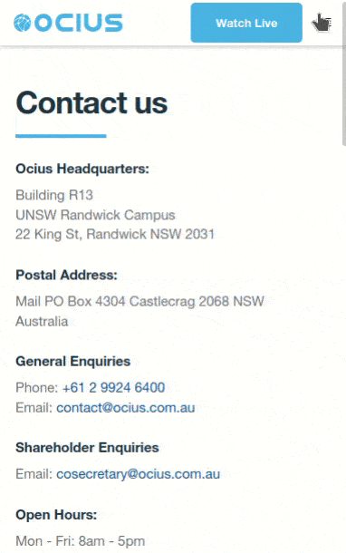

# Ocius Website v.2 🚀

This is improved, redesigned version of Ocius website (https://ocius.com.au). Ocius Technology Ltd (formerly Solar Sailor) is an Australian public unlisted company with Research and Development facilities at the University of NSW. The company is widely recognized in the international marine transportation industry.

## What's changed since v.1? 🔍

Ocius started as a yet another WordPress-based website, but later the company management decided to improve website speed. That's how the [Gatsby](https://www.gatsbyjs.com/) framework was chosen. While it did help the speed, the website had the same old design. What you see right now is the work of web designer *Chris Larcombe* — he did amazing job, gave a fresh look and feel to the company. Not to mention the help of developer Kevin Chan and me, who spent endless hours polishing the UI, also trying to improve every little bit of code.

Also,

- We removed ~~[Carbon Components](https://www.carbondesignsystem.com/)~~. Unfortunately, this bloated library don't mix very well with styled-components. It added a ton of dead code and unnecessary dependencies, even though we used only a few controls. R.I.P.
- HTML Microdata was added to contact page.
- Better optimization for tablets, mobile devices.
- Some of the bugs were fixed, memory leaks.
- More consistent codebase, code was heavily refactored and simplified.
- **New component** - SideNav ⭐



## Structure 📖

The project is split into two parts, [main website](https://ocius.com.au) and the [live page](https://ocius.com.au/live). You'll probably just want to head over over there and see them directly on the web. Technologies are used:
- [GatsbyJS](https://www.gatsbyjs.org)
- [AWS Amplify](https://aws.amazon.com/amplify/), hosting
- [Styled Components](https://styled-components.com)
- [Loadable Components](https://loadable-components.com) - only in some places.

## Coding style

This project uses prettier (with Airbnb config). The project also uses ESLint to enforce good practice and consistency, the configuration is common to the whole project, to run it:

```
npm run lint
```

## Installation

```
# Clone this repo
git clone https://github.com/ocius/website ocius

# Change directory
cd ocius

# Install dependencies
npm install
npm install -g gatsby-cli

# Run project locally (for development), go to http://localhost:8000
gatsby develop

# Build the project (for production)
gatsby build

# Test the built project locally, go to http://localhost:8000
gatsby serve
```

## Contributing 

- Check out the `development` branch 
- Commit your changes 
- Run `git push origin development`

