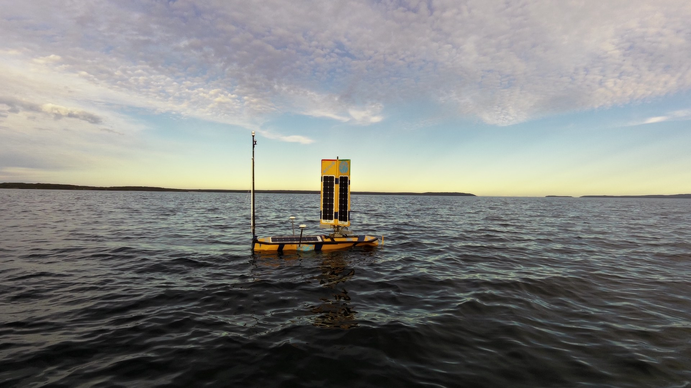

We have completed 10 days of sea trials on Jervis Bay testing a new sensor. Ninan Mathew said “The trials were very successful. We are modifying Nemo’s keel and more trials are planned for July/August.”

Photo shows Nemo Sailing on Jervis Bay at dusk

For more information regarding Blue Nemo, [Please click here](/usv#overview).
