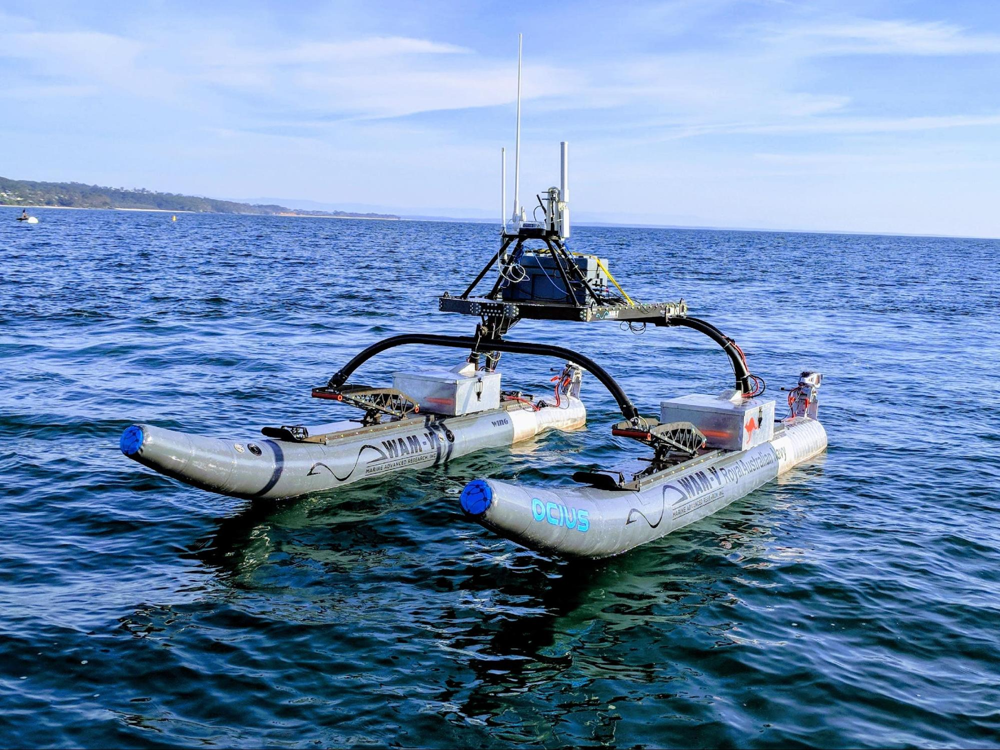
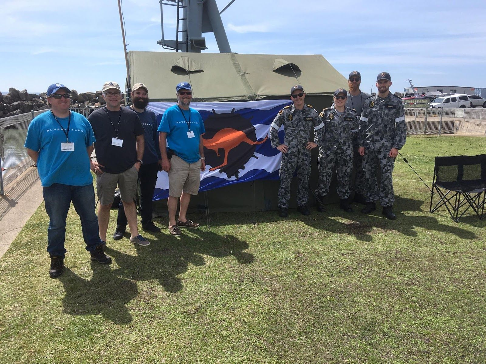

Ocius DST Group contract to assist Navy engineers at HMAS Waterhen to command and control of their WAMV for AW18 war-games.

*PHOTO: WamV “Grim” at AW18 with Ocius power and C2 system*

LEUT. Harry Hubbert from HMAS waterhen said, ” The WAMV is an excellent example of what can be achieved when intelligent and efficient SMEs like Ocius technology Ltd and the Royal Australian Navy team up. Ocius has been essential in the development of the WAMV platform and it would not be at the point it is without them. Ocius integrated their control system, HMI and sensor management software and helped tremendously with the propulsion system components to ensure the WAMV was ready to participate in the Autonomous Warrior 2018 exercise. I am forever grateful for their help and hope to continue working with them in the future ”

“It was meeting with LCDR Peter Talbot from HMAS Waterhen at the Maritime Environmental Working Group (MEWG) in Canberra that started all this.’ said Robert Dane. “HMAS Waterhen’s bright young engineers were keen to apply their knowledge and ideas to demonstrate an unmanned vessel aiding in mine hunting. We didn’t have much time! With a great attitude from both teams, the result is a 10knot, short duration platform that can go out over a minefield and control DST’s UUVs and relay back to ‘mission control’ on a vessel at a OCIUS and HMAS Waterhen teams at AW18 safe distance or to base”

