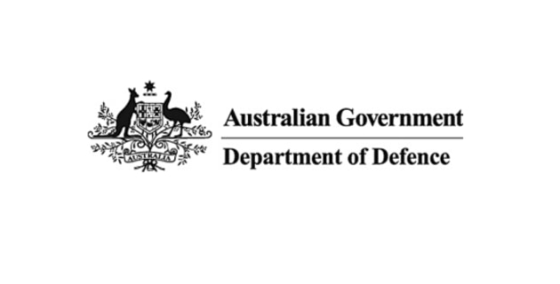
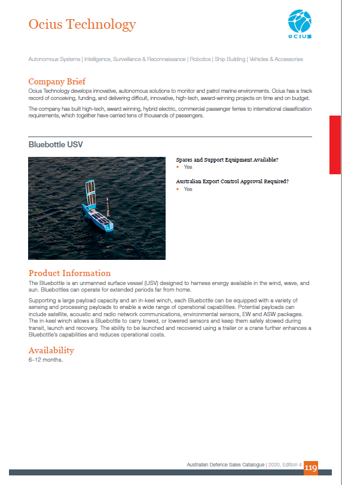

"Launched by the Minister for Defence Industry, the Hon Melissa Price MP, on 19 March 2020. The 2020 edition provides information on surplus ADF equipment for sale across the maritime, land and aerospace domains to foreign government customers, as well as showcasing 170 Australian defence industry companies with world-leading products and services."

This year's edition showcases Ocius Technologies' Bluebottle USV.

[See the full press release here](https://www.defence.gov.au/Export/australian-military-sales/)
