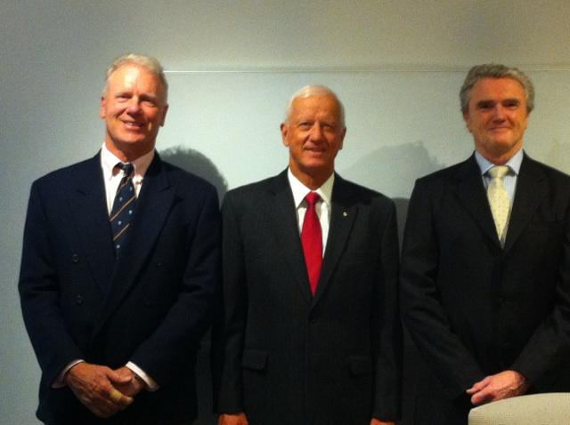

The AGM for Ocius was held at Sydney this Monday, the 19th of November 2014.

**Mark Bethwaite, Chairman of Ocius** raised the fact that the road to commercialisation

*   Takes longer than planned
*   Costs more than planned
*   Obstacles appear that were not planned
*   Investors are gun shy until risk is minimal
*   Customers require certainty of performance

Why do the shareholders continue to support Ocius?

Because we strongly believe in

*   **Our technology**
*   **Our PRODUCTS**
*   **Our potential MARKETS**
*   **OUR CEO and team**

**Robert Dane, CEO of Ocius** presented the developments and achievements of Ocius in 2014 and reiterated the focus of the company to development of USV’s and commercial shipping. Opportunities in hybrid ferries and large shipping applications and our [new patented opening rigid wingsail](http://solarsailor.com/new-rigid-opening-wing/) were also introduced to the shareholders.

Robert also informed the shareholders that our first commercial vessel, the multi award winning “_SolarSailor”_ was sold to a private buyer. The new owner plans to convert her to a live aboard cruising vessel to explore the East Australian coast and then SE Asia.This pragmatic business decision gives Ocius a significant cash boost at this time as well as freeing management to focus time and resources on our core business –selling technology and data for Uncrewed Surface Vessels and commercial shipping.

