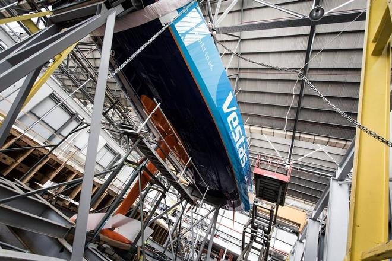
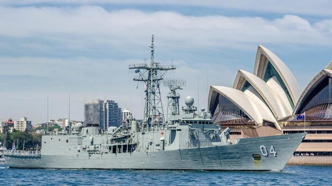
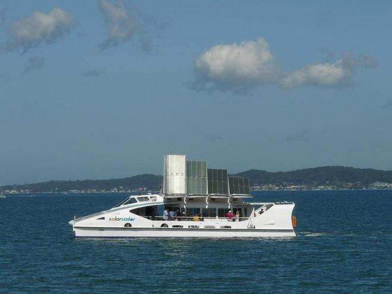
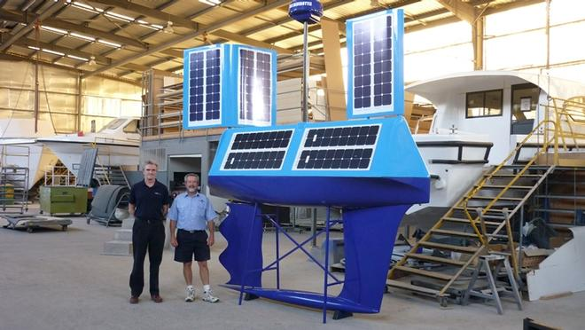
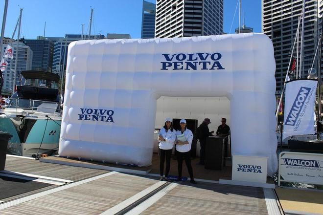
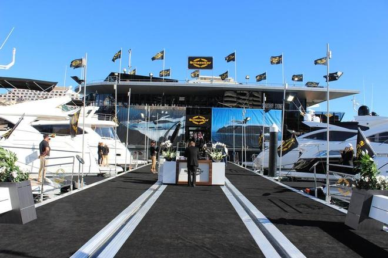

This week, we cover the marine world, from Spain to Sydney and everywhere in between, including the very pleasant Audi Hamilton Island Race Week, where rainy skies have cleared to turn on impeccable spring racing conditions.

News this week of the seventh and final team which will line up for the Volvo Ocean Race 2014-15, starting 4 October in Alicante, Spain.

The world’s largest wind turbine builder, Vestas has sponsored ‘Vestas Wind,’ the first-ever Danish boat to compete in the Volvo Ocean Race, to showcase the Vestas brand, enhance customer relations and bolster Vestas’ profitable growth strategy on its race around the world.

Calling on 11 ports and taking sailors on a 38,739-nautical-mile race around the world. By harnessing the power of the wind, Team Vestas Wind will strengthen Vestas profitable growth strategy as the race visits many of its most important markets, from Brazil and China, to South Africa, the United States and the Middle East/North Africa region.

If only Australia were one of the destinations . . .

From AIMEX this week, news that it has expanded to include a commercial marine division. AIMEX President Richard Chapman said ‘this has been on our drawing board for some time as more and more of our members in both the marine export and superyacht sectors have diversified to focus on the commercial /defence sector.’

Businesses in this sector need a voice to government, they need to understand where their future work is going to come from, how big the supply chain is, who are the key primes driving the industry and how they get access to these companies. This sector is concerned regarding how to retain the skills and experience in the industry especially when we see the government giving large contracts offshore.

Our congratulations to AIMEX for the foresight to make this stand.

Something close to my heart – one of the first marine stories I ever covered back in 2001 – Solar Sailor’s original boat is up for sale. Currently operating on Lake Macquarie as an event cruise vessel, it will be sold before the end of the month.

Years ahead of its time, like its founder, Robert Dane, this incredible hybrid boat used solar and wind power as well as LPG. Solar Sailor has sold five units to Hong Kong/China, where the owners appreciate their use of half the fuel of their predecessors. If only our own Councils and governments were as visionary.

Solar Sailor, now rebranded as Ocius, is now focused on unmanned solar/wind/wave powered drones, which are increasingly popular around the world for work that is hazardous, dirty or remote.

In other features this week, the winners of the Sydney International Boat Show best displays for 2014.

Well done to the dealers and brands who pulled out all stops to present something special in this, the first year of dual venues. Your effort made SIBS 2014 a spectacular show!

On the topic of shows, a lesser known but show with potential – the Marina Mirage boat show this year was the catalyst for a flurry of yacht sales on the Gold Coast. Ian Swan from Swan Super Lines has enjoyed a great start to the financial year, registering sales of some significant yachts to cashed-up Kiwis taking advantage of the GC’s great weather and boating lifestyle.

Have a great week on the water!

Jeni Bone, editor
