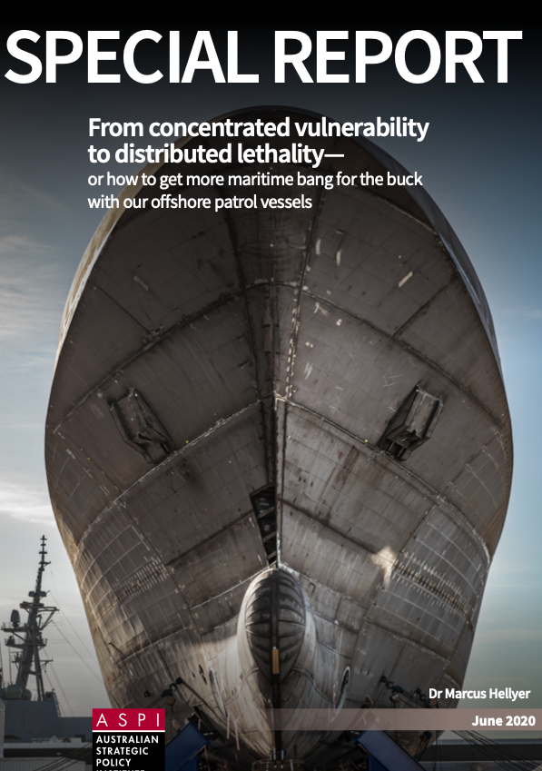

# Key points

"The centrepieces of the government’s naval shipbuilding plan—the Attack-class future submarine program (SEA 1000) and the Hunter-class future frigate program SEA 5000)—don’t provide significant opportunity for stimulus spending because both are still in the design phase"

"Because it often regards unmanned and autonomous systems simply as poor replacements for traditional manned platforms, Defence tends to overlook the benefits they offer"

"This variant would be able to rapidly deliver and deploy numbers of small unmanned surface vehicles (USVs) and UUVs, potentially to establish a sensor barrier. Autonomous USVs such as Ocius’s Bluebottle can tow small sonar arrays. By employing AI, swarms of Bluebottles can form sensor barriers that react to threats in the most efficient and effective way. While small USVs have limited power, they have virtually unlimited endurance.

Moreover, by aggregating their sensor data, they can cover a significantly greater area than a single traditional large surface combatant.

After deploying the barrier, the OPV could then leave them to collect more USVs or UUVs, or loiter, either to conduct
maintenance on them or to protect them against harassment or other forms of interference. The standard OPV can
probably perform much of this role already; since two small USVs such as the Bluebottle can be carried in a 20-foot
container, a standard OPV can already carry 12, even before any modifications to increase its capacity."

## CONOPS

"The team would probably include a frigate, if the team’s primary mission is ASW, for example. The swarm’s AI would generate search patterns using the OPV’s towed array, its USVs’ smaller sonar array and the dipping sonar on the frigate’s helicopter. It could also be supported by small, persistent USVs deployed by the OPV to create a responsive sonar barrier. AI would also process the signals to locate the enemy submarine, and lethal weapons effects would be
delivered by the frigate’s helicopter."

"An OPV squadron tailored for UAV and USV surveillance could rotate frequently through the South Pacific, demonstrating our commitment to support South Pacific nations’ sovereignty over their maritime resources, as well as demonstrating to any external powers that we have a continuous presence in the region and will immediately respond to their activities"

## Recommendations

"Equip the variants of the OPV fleet with appropriate mixes of unmanned and autonomous systems so that it can
effectively contribute to maritime and amphibious operating concepts employing distributed lethality."

"facilitate the integration of Australian-developed unmanned and autonomous systems into the combat cloud "

" Provide an immediate stimulus and greater financial security to Australia’s research universities and high-tech sector by using the funding in Recommendation 8 to: fund innovation proposals for defence technology that were assessed as worthy but for which there was previously insufficient funding "

[Read the full report here](./report_cover.jpg)