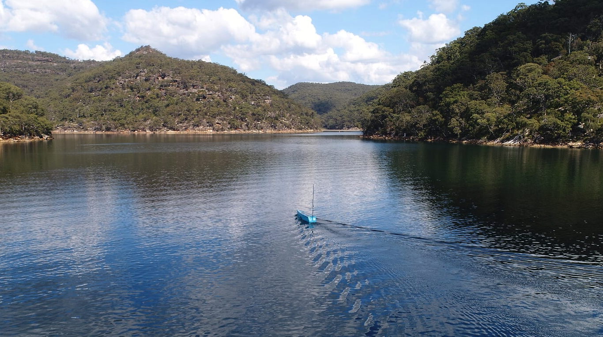
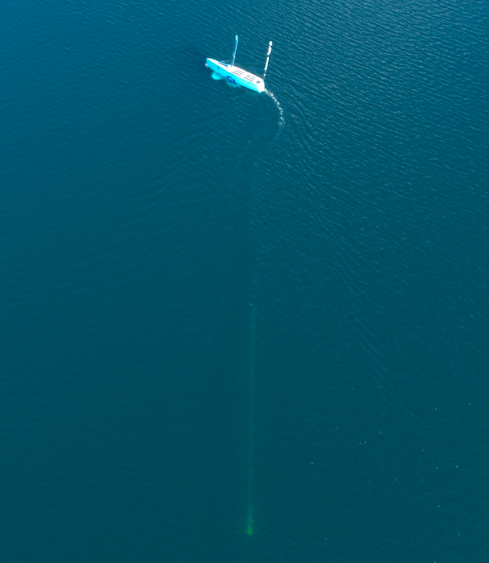

Since we finished our trials off the NSW Coast and our last update.

1.  We’ve submitted our final written reports and have been paid in full for our Defence Innovation Hub contract - 3 months ahead of schedule. We’d like to thank the Defence Innovation Hub, DST Group and Navy for a terrific and cooperative working relationship leading to a great outcome. 

2.  We are very pleased to announce that Mark Bethwaite AM is back in Australia for the next 12 months and is back on our board as our Chair. He joins Andrew Aitken, our corporate lawyer and independent director and Geoff Zuber, non-executive director on the board.

3.  Mark conducted several media interviews recently at the NSW Government launch of Pacific 2019 Expo with the NSW Deputy Premier Hon. John Barilaro, MP.

<iframe width="100%" style="min-height:360px" src="https://www.youtube.com/embed/6Ni_Y9REScg" frameborder="0" allow="accelerometer; autoplay; encrypted-media; gyroscope; picture-in-picture" allowfullscreen></iframe>
Mark on Channel 9 News

If you missed it on Ch10, 9 and 7, please see [here](https://ocius.com.au/blog/bob-in-the-news/ocius.com.au/news) for the latest news. The story also secured blanket newspaper media coverage syndicated to over 130 publications across Australia and also New Zealand.  

4.  We’ve started testing persistent ‘bistatic’ sonar surveillance capability with Thales Australia, applying their thin line array on a Bluebottle USVs winch and lowering to varying depths firstly in Sydney’s beautiful Ku-Ring-Gai Chase. We extend many thanks to NSW National Parks and Wildlife Service and Roads and Maritime Services for access to the Smith Creek trials area.  (See photos below)

Next week 2- 6 Sept we’ll be off Ulladulla doing ocean testing in deeper open waters enabling the winch to deploy the array fully.  We are grateful once more to our friends at Ulladulla Marine Rescue, who are helping us out again by acting as the Suspected Illegal Entry Vessel (SIEV). All Ulladulla shareholders, friends and colleagues are very welcome to come down and see us in action.

UAV multimedia courtesy of Thales Australia.

We look forward to updating you again soon.
