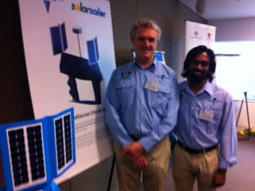
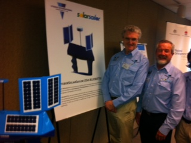

Robert, Ninan and Alan outlined the advantages of “Bluebottle” unmanned surface vessels (USVs) of power payload and persistence/seaworthiness and meaningful speed of advance in all conditions.

The feedback from stakeholders was very positive and further engagement with the members present is underway.

Robert Dane thanked Chris Williams, Chair of SADIG Executive, SADIG Committee members, and NSW Trade and Investment for the opportunity to present the Ocius Steber unmanned surface vessels ‘Bluebottles’ to the conference.

