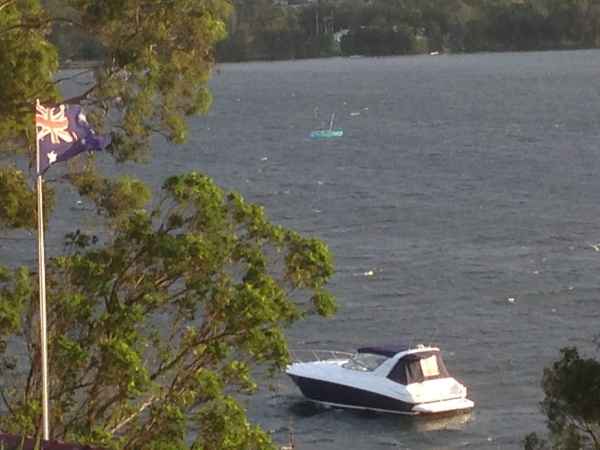
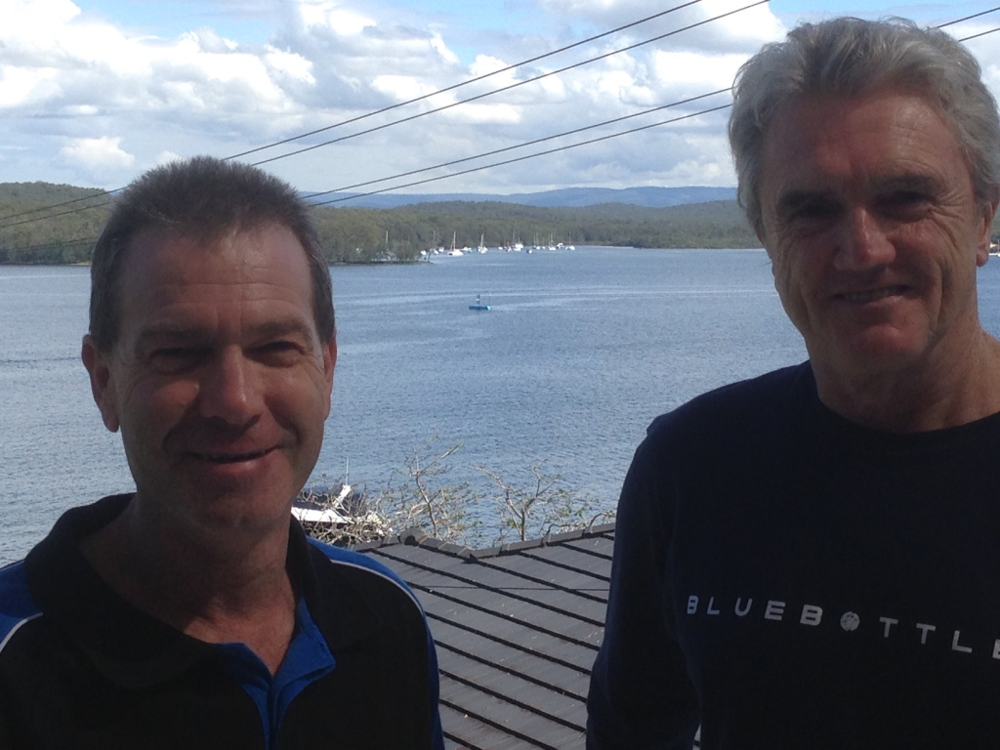

Chief Engineer Lloyd Breckenridge said ”Today we completed 12 days of trials on Lake Macquarie from Monday 27th March to Friday 7th April. We tested Bruce’s power management and solar recharging, waypoint sailing, position holding in a number of modes and collision avoidance. The weather was raining and overcast 11 out of the 12 days but even on dull days the diffuse light gave our solar sail and deck panels power ranging from 100 – 350 watts.

**1) Bruce in 20 knot southerly conditions sailing figure of 8 patterns over a waypoint**

Robert Dane said “This week we proved even in the worst weather we are sustainable. What was pleasing was the amount of solar energy our solar sail could harness at dawn and dusk. After Easter we will begin trials on Jervis Bay and in the ocean.”

**2) Colin Steber from Steber Internaitonal Boat Builders with Ocius CEO Robert Dane and ‘Bruce’ in background**

Colin Steber said ”I’m thrilled now seeing “Bruce” the USV sailing and going through its paces in all weather conditions This project has been exciting from the very first concept designs, through the 2.8m ‘Nemo’ prototype and now the 5.6m  ‘Bruce’ hull design from the ‘Wild Oats’ Naval Architects to manufacture and now working.
