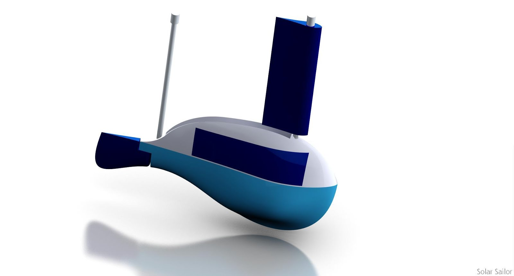
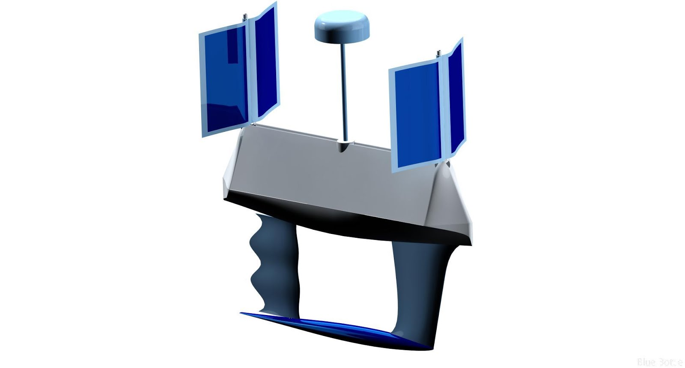
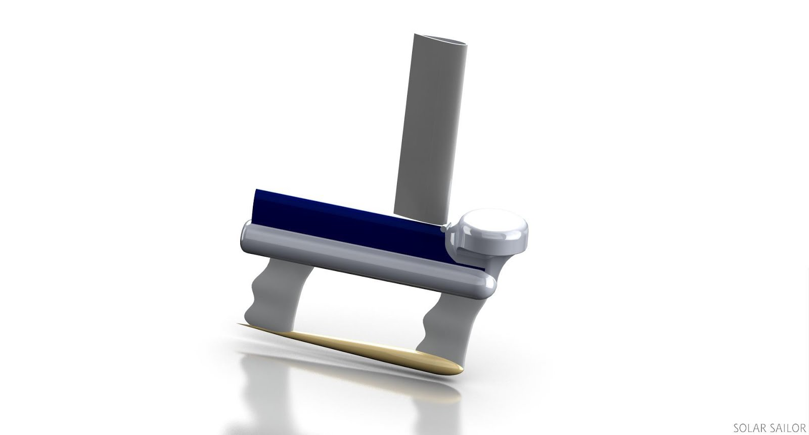

**SolarSailor and innovative NSW boat builder [Steber International](http://www.steber.com.au/ "Steber International") are launching their new range of revolutionary unmanned surface vessels (USVs) called ‘Bluebottles’ at Pacific 2013.**

The Pacific 2013 exhibition coincides with the 100th Anniversary of the Australian Navy and is free to enter. Two full size prototype Bluebottle models will be on display at the NSW Innovation Section in the middle of Hall 3 (Booth 3B2 near the delegate’s dining area).

### 2 metre, oceanographic sensor suite

### 3.5 metre, standard suite plus 40kg payload

### 5.9 metre, standard suite 80kg payload

Bluebottles combine Steber’s proven 50 years of quality rugged boatbuilding with SolarSailor’s proven patented technology developed over 14 years.

Following computer modeling and tank-testing at the University of Wollongong’s new Department of Oceanographic Engineering under an Enterprise Connect award, we are conducting sea trials such that by March 2014 our first fully autonomous 2m oceanographic Bluebottle will be deployed off the Great Barrier Reef supplying specific oceanographic data to research organisations.

The worldwide market for unmanned surface vessels is directly proportional to all the information and intelligence gathering requirements desired by authorities which includes oceanography, defence, border protection, hydrography, fisheries and oil and gas and security.

The defence industry alone is estimated to be a $3.8 billion market in the next 7 years, according to a 2013 Market Info Group report.

Characteristics for success identified in the defence market are endurance, payload, coverage, low capital cost and low cost /byte of data. Such a USV is described as ‘disruptive’.

The Steber SolarSailor Bluebottles have these characteristics, which are not identified together in a current known competitor. Current USV technologies are in their infancy and give a maximum operation of weeks or have very low power, speed, endurance and data rates. Bluebottle’s design increases payload, endurance and power and is protected by multiple patents of the new opening solarsails and the platform itself.

Bluebottle’s operate on energy available at sea. They require no fuel, no crew, no supplies. They are self-deploying and self-retrieving. They can roam widely or be kept on station virtually indefinitely. They provide a stable ‘roll dampened’ platform for low-cost cameras, radar and sensors for above the water, at sea level and below surface monitoring and surveillance as well as providing communications linkage between subsea monitors and vessels, surface monitors and vessels and aerial vehicles and satellites. Bluebottle’s unique design means it has full functionality to Beaufort Seastate 5 and survivability with some mission degradation up to Beaufort Seastate 7.

Bluebottles are perfect for ‘dull, dirty or dangerous’ missions. Conventional methods of data collection at sea such as ships, buoys, air surveillance and satellites each have their own limitations in their ability to gather accurate data and transmit it when compared to the vastness of the world’s oceans, the cost of men and fuel and the requirement for 24 hours a day, seven days a week, 365 day per year persistent coverage.

Bluebottles can augment Navies, governments, companies and research organisations to increase their capability and reduce cost, while placing no one in harms way.

Save time by [registering online](http://www.pacific2013.com.au/enews/Pac2013-Trade-Visitor-Invitation.html "Register")

