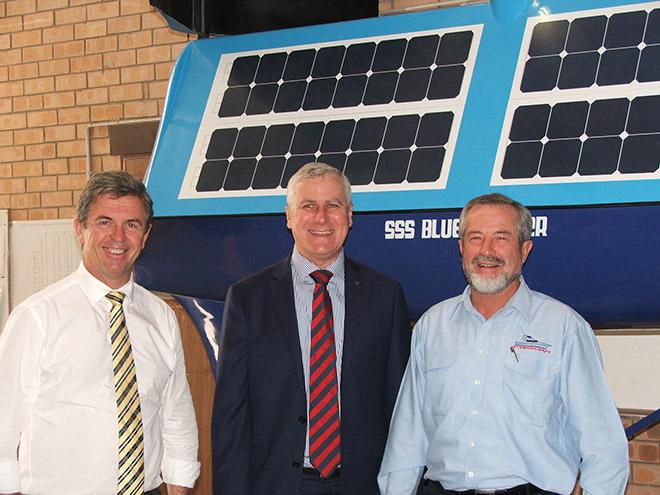

  The construction of Ocius’ latest 5.6m long BlueBottle Stinger begins at Steber International in Taree following the visit from Federal Assistant Defence Minister, Michael McCormack. The visit was part of a tour of the Lyne Electorate with sitting Member, Dr David Gillespie.

During his visit, Michael was impressed with the quality of workmanship and diversity of manufacturing at Steber International’s Taree factory complex. He was able to inspect Ocius’ full scale model of the 3.5m Bluebottle surface surveillance drone which is currently under development. He also witnessed work start on the 5.6m Bluebottle version, aptly named Bruce, after founder Bruce Steber, Bruce Heggie from the NSW South Coast and the character from the movie “Finding Nemo”.

This new Bluebottle is being developed under an Australian Defence Department CTD (Capability Technology Demonstrator vessel) program with a brief to produce a world-first unmanned surface surveillance vessel to detect submarines. Interestingly the hull design is by Wild Oats naval architect.

Dr Gillespie was full of praise for Steber’s manufacturing excellence and growing export capacity and noted that the company’s ongoing research and development program will help ensure Steber’s continued growth and success.

Read more by clicking **[here](http://www.marinebusinessworld.com/145843)**.
