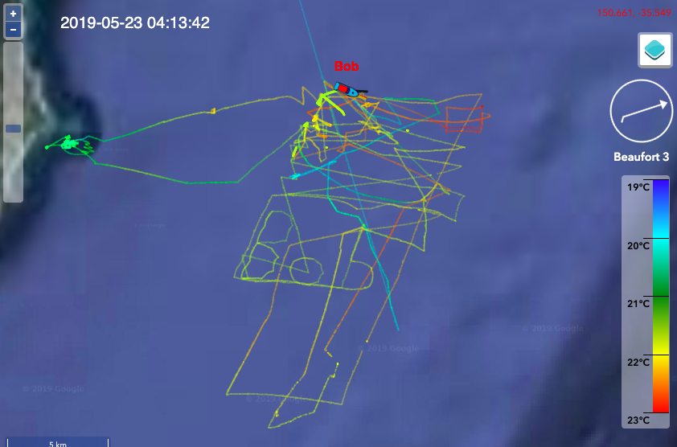
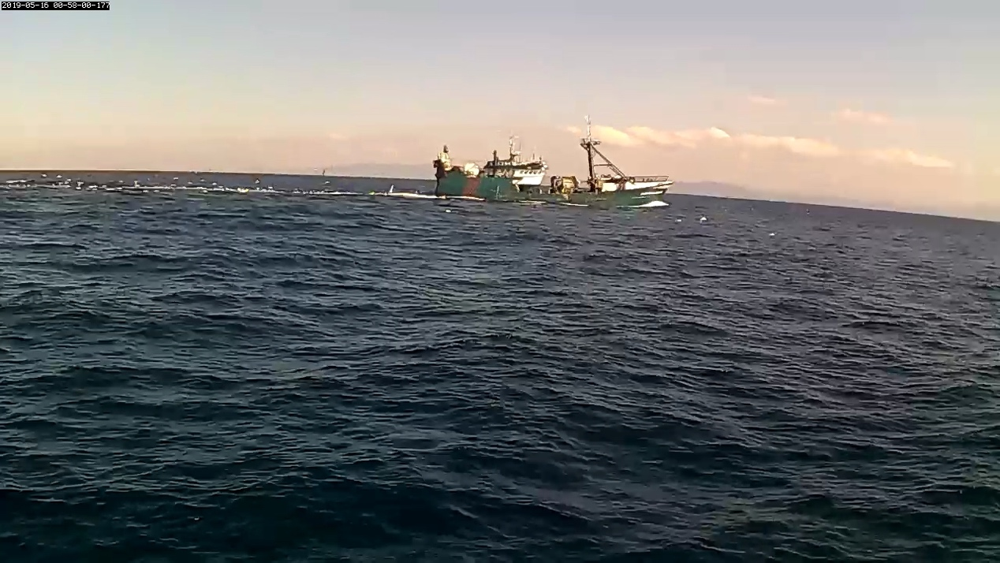

As part of our Defence Innovation Hub contract for the Defence Science Technology Group, we have completed our first endurance trial off the NSW Coast in the ‘box’ approved by AMSA, NSW Transport & local fisherman (see last update) for the testing of unmanned systems.

This area of ocean is well known for the East Australia Current (EAC), which we found running at 1-2 knots NE to SW. You can see the ‘sags’ in some of ‘Bob’s’ transit legs above. 

If we were transiting to a destination, then like a surfer or lifesaver, we would exit the current or use the current, but this mission requiring staying in the box made it actually harder, as the entire body of water was moving relentlessly south. If ‘Bob’ couldn’t navigate, he’d be swept out of the bottom of the box in 6 -10 hours! 

By the end of a week, as the team revised, uploaded and tested new algorithms for certain headings and conditions, ‘Bob’ was sailing and tacking brilliantly and combined with wave and solar power was able to navigate freely in the box sustainably - even signing his artwork.

We thank AMSA, Transport NSW, Ulladulla Marine Rescue, local fishermen, and all mariners (including those who sent us photos of ‘Bob’) for their help and support during the trial.

We now have enormous quantities of data to analyse and have to upgrade our other USV ‘Bruce’, so we are heading back to our facility at UNSW for the next 2 weeks and then returning with two Bluebottles to test some intelligent networking scenarios.

We look forward to updating you then, meanwhile, please see our new superfast website: [www.ocius.com.au](www.ocius.com.au) for more information.
