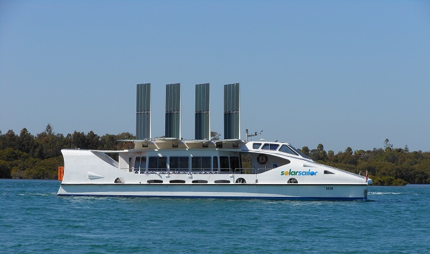
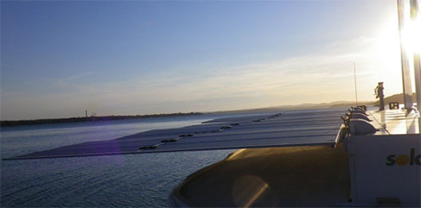

**Solar Sailor Lake Macquarie is up for sale. This pioneering vessel is a hybrid boat that relies on LPG and solar and wind energy for propulsion.**

Having been in operation for 18 months on the Lake and previously on Sydney Harbour for 10 years as a Captain Cook Cruise ship, this hybrid boat relies on both generator power and solar/wind energy. It uses LPG gas and can run for 20 hours, and under solar and wind power it can do 5 knots.

It won the Australian Design Award in 2001, among many other awards over its life time.

‘It’s beautifully quiet and the dolphins love it,’ says inventor and CEO of the company now called Ocius, Robert Dane. ‘At the time, it was the largest solar powered boat in the world. It was ahead of its time using hybrid electricity.’

‘We have built five of these boats, four for Hong Kong and one for Shanghai. They use 50% of the fuel of the boats they replaced and of course, the Hong Kong Jockey Club which runs them is very pleased with that.’

Time is running out. There have been several offers, both locally and overseas bidders, but it would be great to maintain the ongoing business.

The Solar Sailor is currently doing events and cruises for special occasions. It has become very familiar, continuing the tradition of the boat on the Lake in the wake of the Wangi Queen, which operated for 35 years.’

Ocius is mostly focused on solar-wind-wave powered unmanned vessels, such as the Solar Sailor Blue Bottle developed in collaboration with Steber International. ‘Uncrewed drones are becoming increasingly popular, with the rising costs of fuel.’  
Bluebottles combine Steber’s proven 50 years of quality rugged boatbuilding with SolarSailor’s proven patented technology developed over 14 years.

The worldwide market for unmanned surface vessels is directly proportional to all the information and intelligence gathering requirements desired by authorities which includes oceanography, defence, border protection, hydrography, fisheries and oil and gas and security.

The defence industry alone is estimated to be a $3.8 billion market in the next 7 years, according to a 2013 Market Info Group report.

Characteristics for success identified in the defence market are endurance, payload, coverage, low capital cost and low cost /byte of data. Such a USV is described as ‘disruptive’.

The Steber SolarSailor Bluebottles have these characteristics, which are not identified together in a current known competitor. Current USV technologies are in their infancy and give a maximum operation of weeks or have very low power, speed, endurance and data rates. Bluebottle’s design increases payload, endurance and power and is protected by multiple patents of the new opening solarsails and the platform itself.

Bluebottle’s operate on energy available at sea. They require no fuel, no crew, no supplies. They are self-deploying and self-retrieving. They can roam widely or be kept on station virtually indefinitely. They provide a stable ‘roll dampened’ platform for low-cost cameras, radar and sensors for above the water, at sea level and below surface monitoring and surveillance as well as providing communications linkage between subsea monitors and vessels, surface monitors and vessels and aerial vehicles and satellites. Bluebottle’s unique design means it has full functionality to Beaufort Seastate 5 and survivability with some mission degradation up to Beaufort Seastate 7.

Bluebottles are perfect for ‘dull, dirty or dangerous’ missions. Conventional methods of data collection at sea such as ships, buoys, air surveillance and satellites each have their own limitations in their ability to gather accurate data and transmit it when compared to the vastness of the world’s oceans, the cost of men and fuel and the requirement for 24 hours a day, seven days a week, 365 day per year persistent coverage.

Bluebottles can augment Navies, governments, companies and research organisations to increase their capability and reduce cost, while placing no one in harm’s way.

For enquiries call Robert Dane on 0413 580 953.

by Jeni Bone
