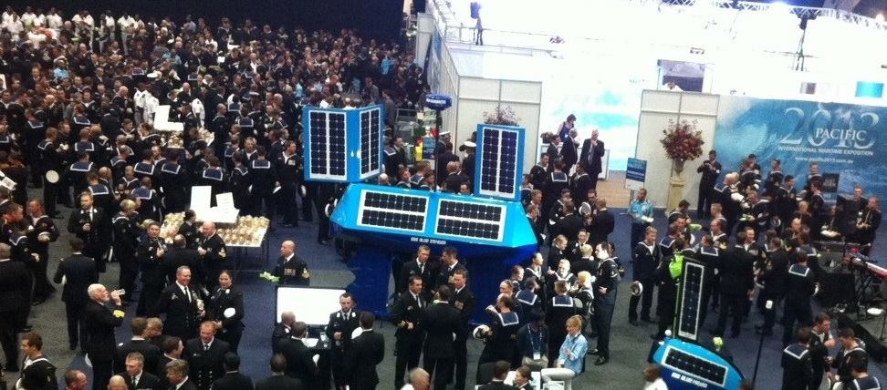
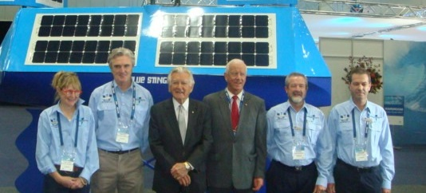

### **Dear Shareholder,**

### It is with great pleasure I present this years’ Shareholder update and invitation to our AGM.

**Unmanned surface vessels:** At the time of writing, we have just finished exhibiting two versions of our unmanned surface vessels with Steber International at the Pacific 2013 Exhibition held at Darling Harbour Convention Centre on 7th to 9th October 2013.

We had excellent feedback from Pacific 2013 as well as from our general marketing activities all confirming the strong potential market for our products. We have had and are continuing numerous meetings with several  
prime defence contractors, both local and overseas, including in the short term with Australian Government people in Canberra in November 2013.

**Ferries:** Our cruise business on Lake Macquarie with our 100 passenger Sydney Solar Sailor (SSS) is proceeding well. We have been well supported by the local council and community and SSS has been “adopted” by several of the dolphins in the lake where nearly every cruise we are accompanied by at least two dolphins rubbing their backs on our bow. We are trialing dolphin education cruises in the January 2014 school holidays.

Our four vessels continue to run well in Hong Kong, with the Hong Kong Jockey Club expressing positive feedback about our ferries and their capability. The vessels are now out of warranty and we are now being paid a  
service fee for analysing data as well for any assistance and call outs. We continue dialogue with the NSW Department of Transport re Sydney Ferries and are we are currently responding to an upcoming Expression of  
Interest for new ferries to operate on the Gold Coast. Bulkers: We have investigated that there is huge potential to reduce fuel and carbon emissions in large ships by using wind energy. New International  
Maritime Organisation (IMO) regulations regarding carbon emissions also become international law in 2015\. On October 8th 2013 we completed and filed with the World Intellectual Property Office (WIPO) a new Patent  
Convention Treaty (PCT) patent for a revolutionary new ‘opening wingsail’ – a wingsail that can open and close and change its camber.

### Drawings of the new ‘opening wingsail’ from PCT patent filed 8th October 2013

Compared to known competitors, we believe that this is the simplest, cheapest, most seaworthy method of harnessing wind power commercially. This patent protects our new design for the next 20 years. We are using them on the unmanned surface vessels and seeking globally a shipping or industry partner to commence a trial of one wingsail on one ship over a 12 month period. Accomplishing this in the next two years will give us the track record to enter and capture the market as this trend develops.

**Corporate:** We have maintained our cash resources through (i) diligent cost restraint, (ii) Directors being paid in shares and (iii) senior management deferring wages ‘until such time as the Company deems it can afford to pay’. We will discuss at this year’s AGM regarding our plans to raise substantial new equity immediately following the AGM (from firstly existing shareholders and then from new third party investors) in order to fund our next 12 months exciting growth plans which includes deploying at least one autonomous oceanographic, unmanned surface vessels off the coast of Australia in 2014 and commence revenue raising activities selling data to both local and overseas oceanographic research organisations.

Your Board is now in the process of appointing new Corporate Advisors to assist with our planned fund raising activities as well as our now planned listing on the ASX within the ensuing 12 to 18 months. We are also currently in the process of refreshing our Board of Directors and creating an Advisory Panel to help refine our Company’s offering and its position in the local and overseas markets. We will advise all shareholders of all appointments in this regard.

**Summary:** I would like to thank the Board of Directors for their continuing support over the past 12 months. During this financial year David Franks resigned as Director after 12 years’ service due to the expansion of his corporate financial services business. David has been our CFO and company secretary for 14 years and instrumental in setting up the corporate structure and governance practices of SolarSailor. On behalf of all shareholders, I thank David for all his fine efforts and support.

During the year we have welcomed to our board Dr Louella Crawford who has been actively involved in Solar Sailor for many years and has a major shareholder since its inception. Louella has contributed substantially towards SolarSailor’s corporate governance, shareholder representation, ethical focus and growth strategies. Finally, I thank all shareholders again for your well wishes and support. With your continued patience we will prevail to capitalise on our past and future efforts. I look forward to seeing you at our AGM and as always I invite you to contact me for any queries or advice.

Kind Regards.  
Robert Dane  
Chief Executive Officer
