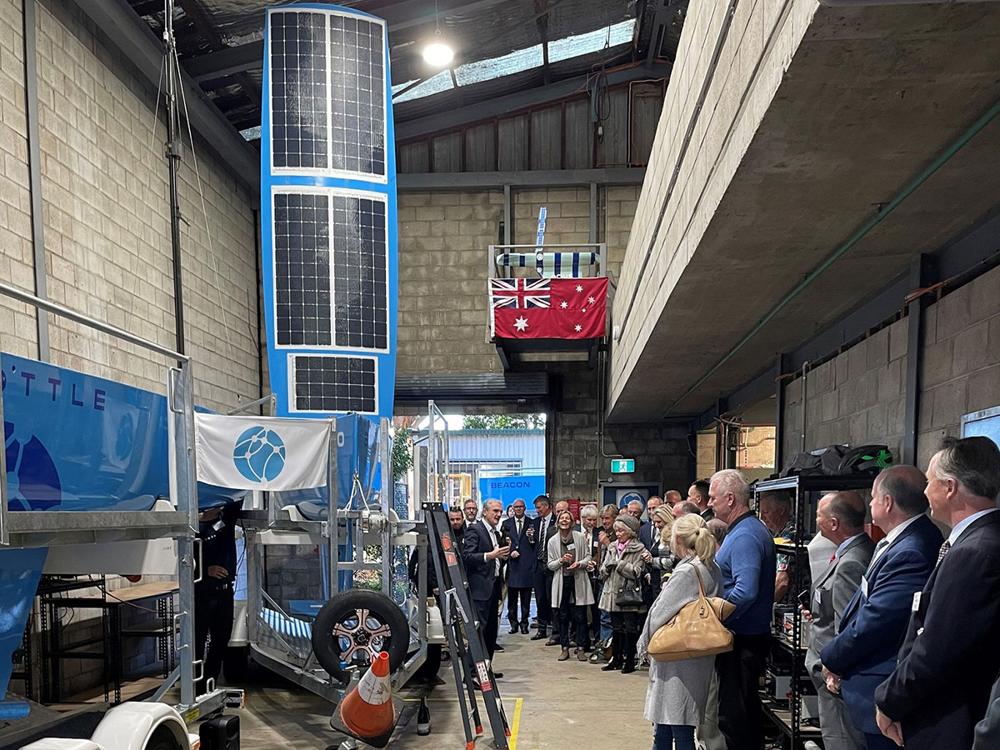
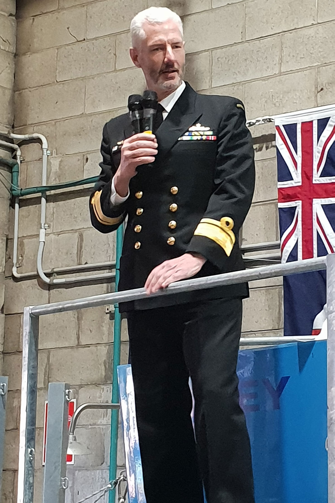
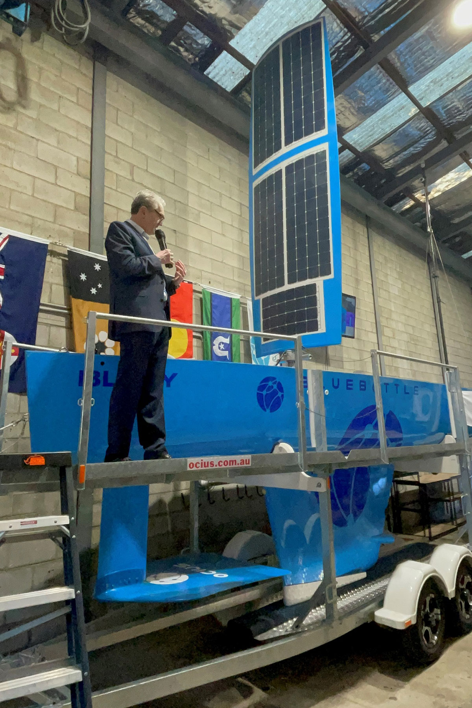
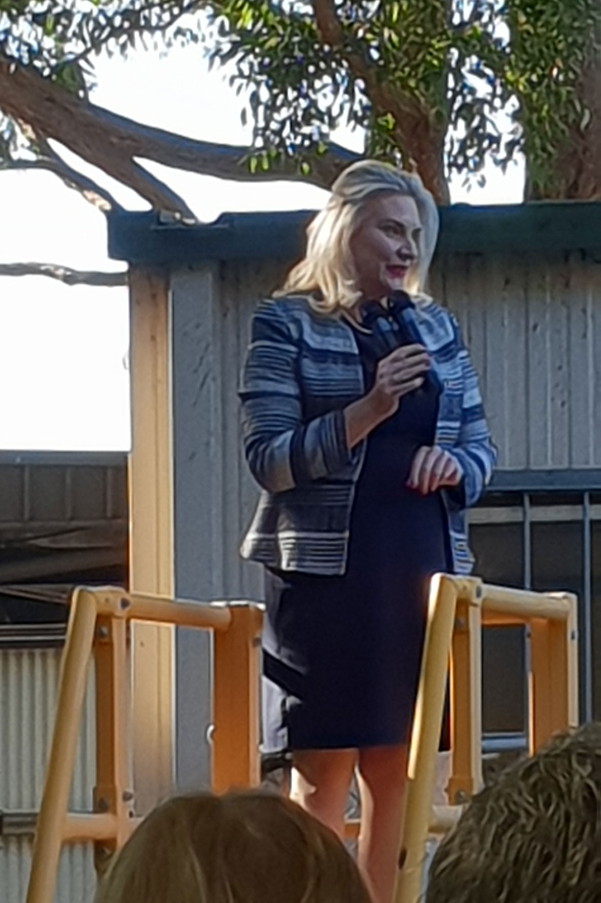
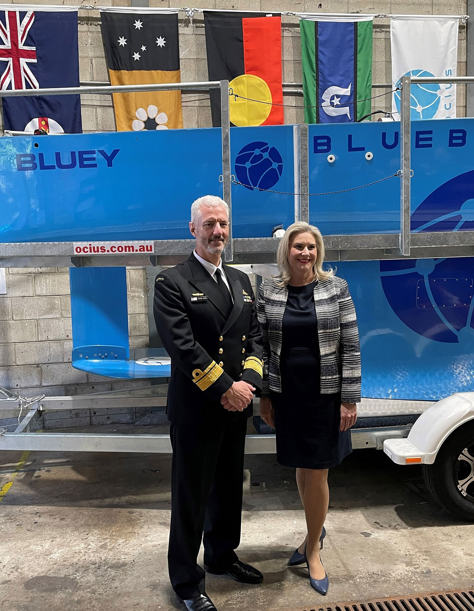
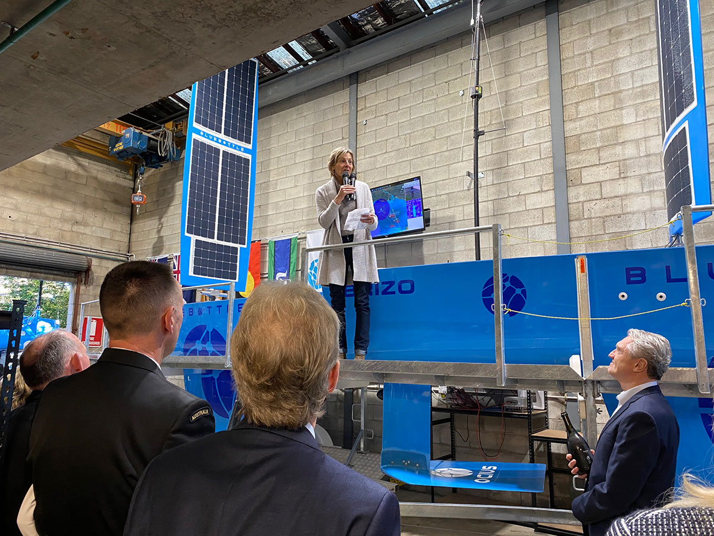
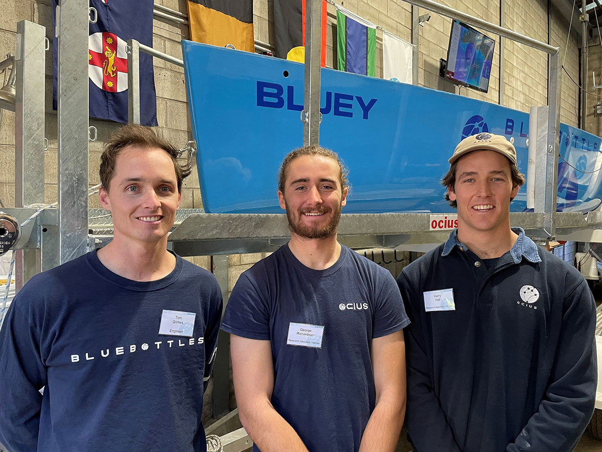
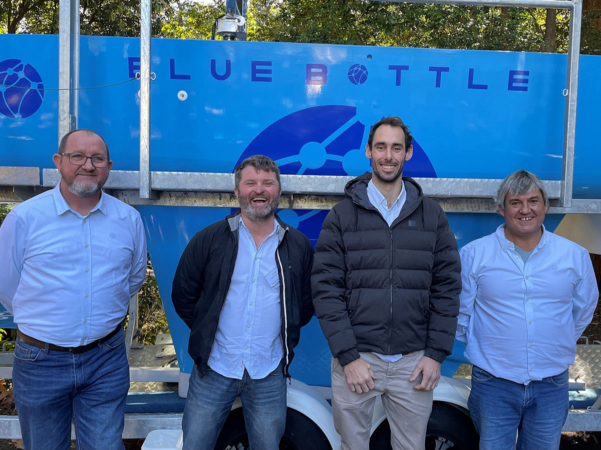

**Christenings 
of 
BLUEY BRIZO BEACON 
Ocius Bluebottle USVs 18 June 2021 
BLUEY - RADM Pete Quinn 
BRIZO (Greek Goddess of Mariners) - Ulladula Shareholder Michelle Moulos 
BEACON - Senator Holly Hughes**

Dear Friends, Shareholders and Colleagues of Ocius,

On Friday 18th of June, the last three Bluebottle USVs in the current set of five were christened at our factory on the UNSW Randwick Campus. 

We were honoured to have RADM Pete Quinn, Senator Holly Hughes standing in for Hon Melissa Price and longtime Ulladulla shareholder Michelle Moulos christen the boats.

[Robert Dane's Address](https://youtu.be/tfZA_KvahKM)

[Rear Admiral Quinn Christens Bluey](https://youtu.be/g7E2HOFkhsc)

[Michelle Moulos Christens Brizo](https://youtu.be/yPB_7lOBqdo)

[Senator Hollie Hughes Christens Beacon](https://youtu.be/wqe9WhGWRq8)

They will join Bluebottles BETH and BEACON in Darwin by Sept and we look forward to updating you on their operations over the next 6 months.

Robert Dane

