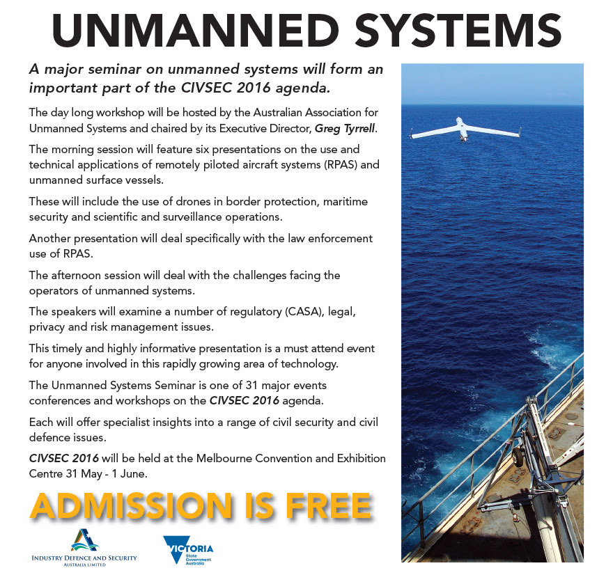

Ocius’ CEO Robert Dane will be presenting at this year’s CIVSEC (Civil Security and Civil Defence Conference) in Melbourne on Wednesday June 1st.

[CIVSEC 2016](http://www.civsec.com.au/) is an international forum dealing with the acutely relevant, and inextricably interconnected, imperatives of civil security and civil defence in the preservation of sovereignty, the protection of people and the safety of communities.

Organised by the Australian Association of Unmanned Systems (AAUS) in association with CivSec 2016, this seminar will address the utility of unmanned aerial vehicles and other autonomous systems in the security and public safety domain, including regulatory and communications/cyber integrity issues for operators.

For a full schedule of the day, please click [here](http://www.civsec.com.au/conferences/conf-AAUS.asp).

