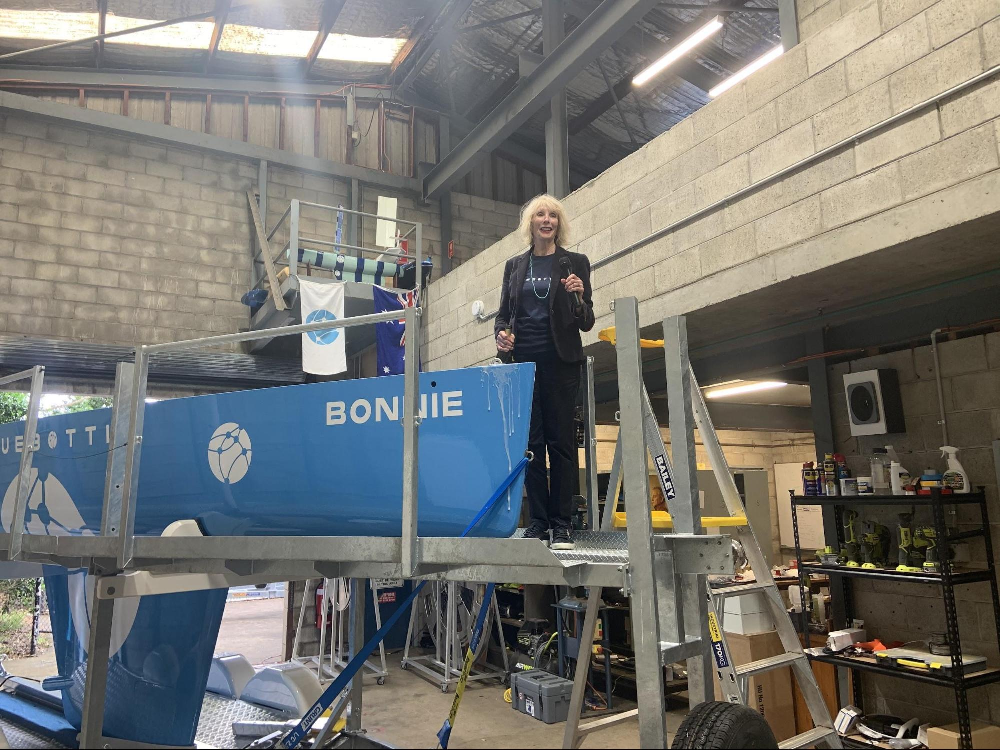
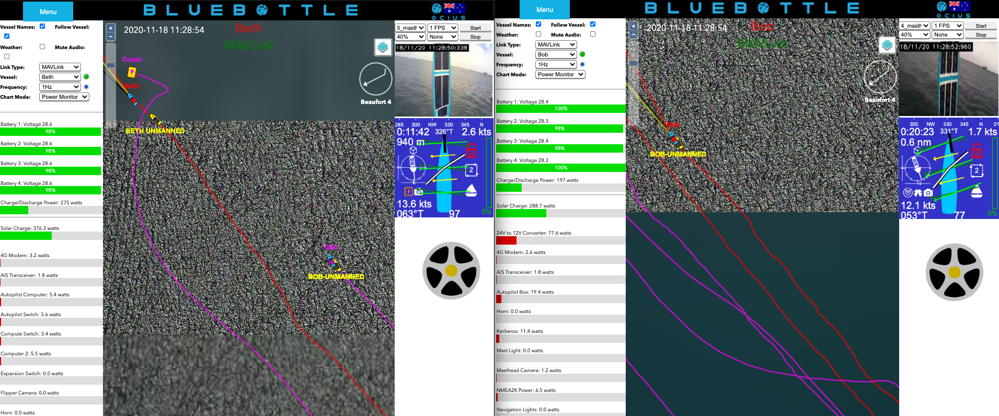
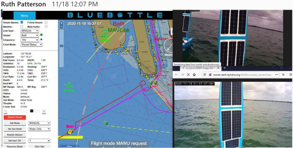
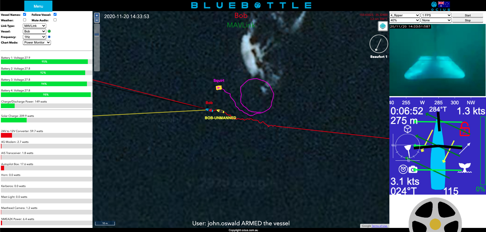

Last week, Ocius held the christening of BlueBottle ‘BONNIE’ by Susie Dane at our upgraded facilities at UNSW. 

The formal ceremony was followed by a stirring rendition of “My Bonnie lies over the ocean’ and a quiet celebration.

<iframe width="100%" height="390" src="https://www.youtube.com/embed/sEQKMtgsmxM" frameborder="0" allow="accelerometer; autoplay; encrypted-media; gyroscope; picture-in-picture" allowfullscreen></iframe>

BONNIE is the second of our BETH class next-gen 22’ Bluebottles, being 3’ longer than our Bluebottles BRUCE and BOB. Under the laws of physics for boats, this extra 3’ gives BETH and BONNIE **2X** the power, payload, performance and winch size than BRUCE and BOB, while still enabling transport by an RTA registered trailer and launch and recovery (LARS) from a conventional boat ramp by 2 people.

Please see below comparison of BETH v BOB in a sailing race on Botany Bay:

BETH 22’ v BOB 19’ in 12 knot wind and overcast conditions.

BETH making 2.6 knots and charging batteries at 275 W.

BOB making 1.7 knots and charging batteries at 197 W.

Following these trials BOB was deployed by road to Ulladulla for rudder flipper trials.

In 2021, 19’ BOB will be deployed to Perth for tests off Rottnest Island and 22’ BETH will be joined in Darwin by her sisters BONNIE and three more 22’ Bluebottles to demonstrate the potential capability of an intelligent network of persistent USVs armed with Thales thin line sonar arrays, radars, cameras and other sensors.
