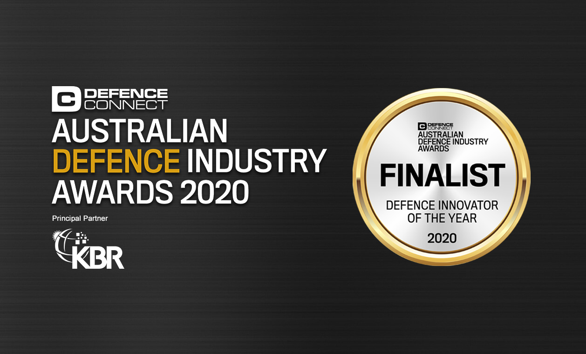

**Ocius Technology has been named as a finalist in the Defence Connect Australian Defence Industry Awards for Defence Innovator of the Year.**

Celebrating its second year, the Defence Connect Australian Defence Industry Awards sets the new benchmark for excellence in defence, recognising the outstanding achievements made by both individuals and firms working in Australian defence industry.

From the major listed organisations and corporates servicing Australia’s defence economy to SMEs, startups, academic institutions and associations, the Defence Connect Australian Defence Industry Awards acknowledges the professionals and businesses that are driving innovation, change and the development of Australia’s defence sector.

The finalists, who were announced over several days beginning on **6 October 2020**, represent over 270 individuals and groups across the defence industry over 33 different categories.

Phillip Tarrant, director - Defence and Aerospace, welcomed the response to the Defence Connect Australian Defence Industry Awards, saying, "the defence industry has once again got right behind the awards, with over 270 finalists shortlisted from over 500 submissions representing over 150 companies."

"This is an extraordinary vote of confidence for Australia’s defence industry and representative of the depth of talent we have in our sector – I would like to thank each of the entrants for their submissions and wish all the finalists the best of luck," Mr Tarrant added.

Robert Dane, Chief Executive Officer at Ocius Technology said that he was humbled to be recognised and proud to be a part of such an extensive network.

"Our great team here at our facility on the UNSW Campus is combining our world-first hardware with cutting edge software to build an intelligent network of persistent ocean-going robots called Bluebottles. This is so that Australian Defence Force, Australian Border Force, Australian industry and scientists can monitor large areas of our oceans, above and below the water with no one in harm's way and at disruptively low cost.” he added.

The winners will be announced on Thursday, 26 November.

[For the full list of finalists visit Defence Connect](https://www.defenceconnect.com.au/australian-defence-industry-awards/winners/2020)

**Neither the Defence Connect Australian Defence Industry Awards nor Defence Connect is sponsored, approved by, affiliated with or endorsed in any way by the Commonwealth of Australia or the Department of Defence.*
