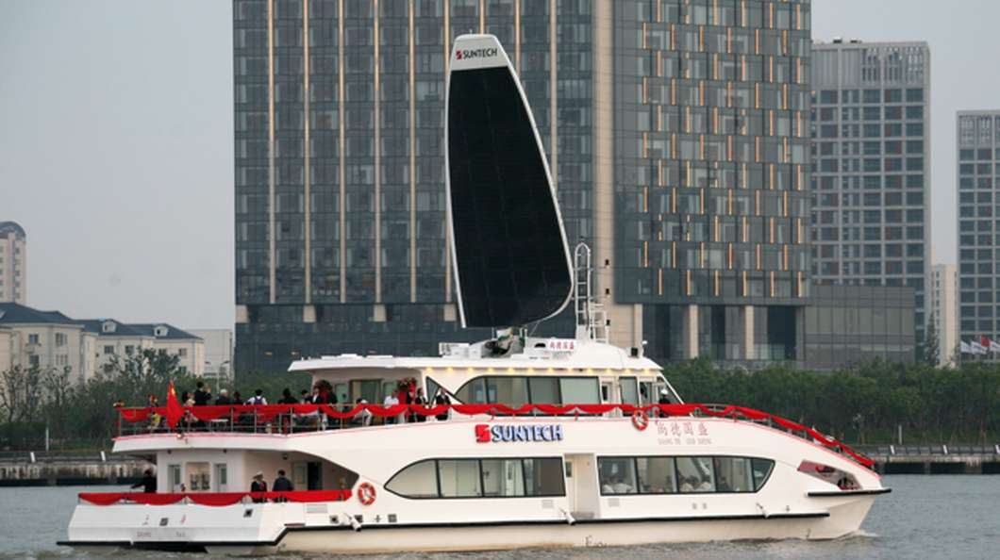

**After a recent acquisition of five solarsailor vessels, China has led the way as the first country to commercialize the solarsailor technology.**

The **SunTech Guosheng** solarsailor vessel will have its maiden voyage during the Shanghai World Expo. It is a VIP passenger vessels using solar and wind hybrid technology designed by an Australian doctor Dr Robert Dane. _“The idea comes from nature”_ Dr Dane said.

_“Insects evolved wings as solar collectors and now boats can evolve wings as solar collectors and use them to sail – creating a solar and sailing boat – a solarsailor”_ he added.

The Suntech Guosheng solarsailor will be the largest solarsailor vessel built to date. It will carry 180 passengers in VIP luxury around the Huangpu River for World Expo.

The **Hong Kong Jockey Club** has purchased 4 solarsailor boats and will be the first commercial hybrid solar passenger ferry service in the world. The Hong Kong ferries use a set up similar to hybrid cars and can travel 17 knots on diesel and 6 knots on electric power.

_“This is a very exciting development for China and I wish to congratulate SunTech for championing this groundbreaking technology. China has the will, the means and the vision – this is consistent with China’s demonstrated commitment to increased investment in clean energy projects”_, commented **Mr. Bob Hawke**, solarsailor Chairman.

Solarsailor Hybrid Marine Power (HMP) and solarsail technology is suitable for a wide range of applications from small-unmanned vessels to large tankers, including ferries, tourist cruisers and private yachts. The solarsail – a revolutionary, patented, single device  
that harvests both sun and wind energy in a seaworthy manner. The HMP system can incorporate the use of alternative fuels such as bio fuels or gaseous fuels & is a commercial platform for hydrogen fuel cell technology in the future.

**ADVANTAGES of the hybrid solar boats have:**

*   Fuel savings
*   Zero emission capability
*   Redundancy of power i.e. there are two completely separate systems driving the  
    propellers giving it safety if one system failed for example due to fuel contamination  
    the electric motors could still operate and if the electric failed the vessel can operate  
    as a normal diesel.
*   Lower GHG, noxious gas and particulate emissions
*   Potential access to environmentally sensitive routes.

**Media enquiries / Interview requests, please contact:**  
**Sarah Andersen**, +61 409 428 173, [sarah@springmedia.com.au](mailto:sarah@springmedia.com.au) or,  
**Fiona Nix**, +61 418 668 760, [fiona@nixco.com.au](mailto:fiona@nixco.com.au)

[Download media release](http://solarsailor.com/wp-content/uploads/2012/01/100519-shanghai-release.pdf)
