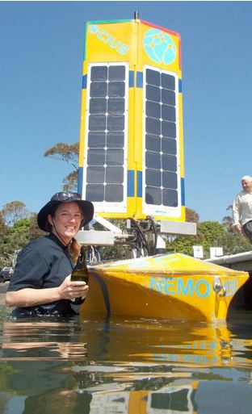

The residents of Ulladulla, NSW, gave a warm welcome to the Ocius team last week and participated in the “christening” of the Nemo USV. Elizabeth Kendall McSpadden tapped the locally shapped fibreglass hull with a bottle of sparkling wine, declaring “God bless Nemo and all who don’t sail in her”. More from the Milton Ulladulla Times [**here**](http://www.ulladullatimes.com.au/story/3399945/nemo-is-found-in-ulladulla/).

  

Picture care of the Milton Ulladulla Times.

