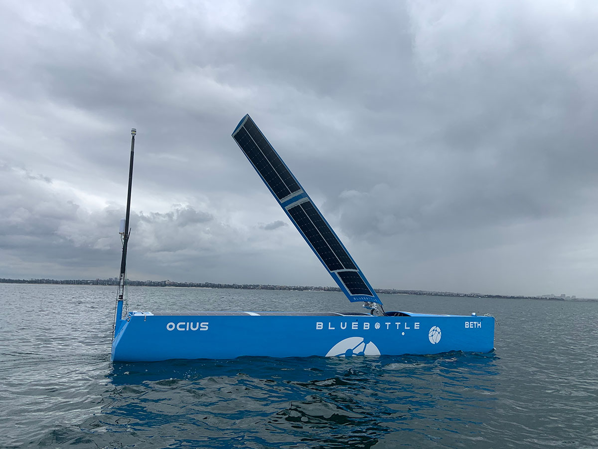
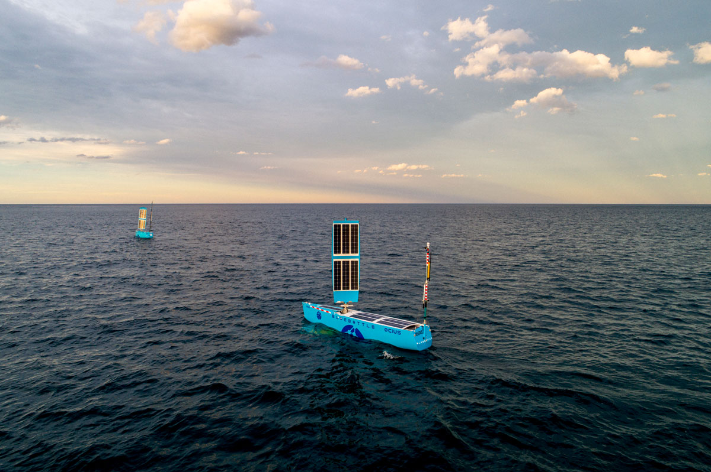

**Cairns/Sydney, 18th December, 2020** – Ocius Technology, world leader in Unmanned Surface Vessels (USV) and Norship Marine have signed a Heads of Agreement to work together in order to develop a sustainment and support model for this new class of vessel. With a unique understanding of the extended mission challenges faced by its ‘Bluebottle’ USV, an autonomous vessel designed to spend weeks or months on station, Ocius is working with Norship’s expertise in supporting marine assets that demand high reliability and availability outcomes.

Both companies are excited by this new collaboration which is designed to provide the assurance and confidence to end customers that Bluebottle USV’s can sustainably and reliably be deployed at sea for indefinite periods of time.

* Robert Dane, OCIUS Chief Executive Officer said “Designing vessels and support systems with reliability, availability and maintainability in mind is paramount to the long term adoption and success of our USVs. The collaboration with Norship represents a further milestone in the “Bluebottle” development cycle. Our design and technological expertise will be further enhanced by Norships’ vast experience in maritime sustainment. *

* Olav Groot, Norship Chief Executive Officer added: “autonomous, self-sustaining USVs which can carry a six-hundred-pound sensor payload present a number of unique opportunities and challenges from a sustainment and reliability perspective. With our engineering teams working closely together we are confident that customer expectations can be both met and exceeded.” *

