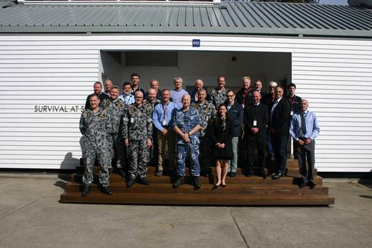

# OCIUS Technology and Thales Australia demonstrate Bluebottle ASWUSV at Jervis Bay with CDF ACM Mark Binskin AO in attendance

On Thursday 10th August, Ocius Technology and Thales Australia successfully demonstrated the solar, wind and wave powered prototype Bluebottle un-manned surface vessel called “Bruce” in combination with a Thales thin line array on 60m of cable off the coast of NSW.

In September 2015, Defence invested $2.85 million in Ocius Technology to develop the demonstration, under Round 19 of the Defence Capability and Technology Demonstrator (CTD) Program.  The CTD program has since transitioned to the Defence Innovation Hub.

We were honoured to have the Chief of the Defence Force (CDF) ACM Mark Binskin in attendance for the trial. Also attending were numerous senior officers of the Royal Australian Navy. It was a hugely successful day and I’m delighted to report the Bluebottle and array combination performed above expectations. Credit must go to the Ocius and Thales engineering teams working together for putting on such an excellent day; congratulations!

CDF centre front with Thursday’s group

Thanks also to the Commanding Officer of HMAS Creswell, Captain Charles Huxtable for being a splendid host and to all the officers, men and women who represented our Department of Defence.

<iframe src="https://www.youtube.com/embed/tJVvp-Oxgcs?feature=oembed" allowfullscreen="" width="100%" height="400" frameborder="0"></iframe>

Kind regards until next time,

Robert Dane

CEO

OCIUS
