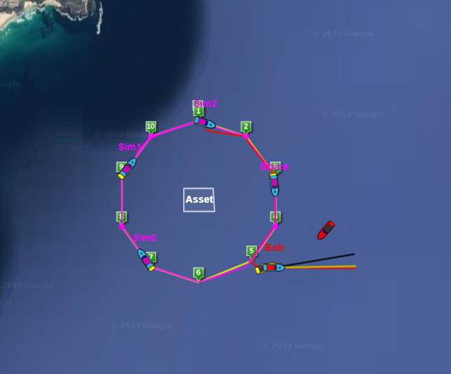
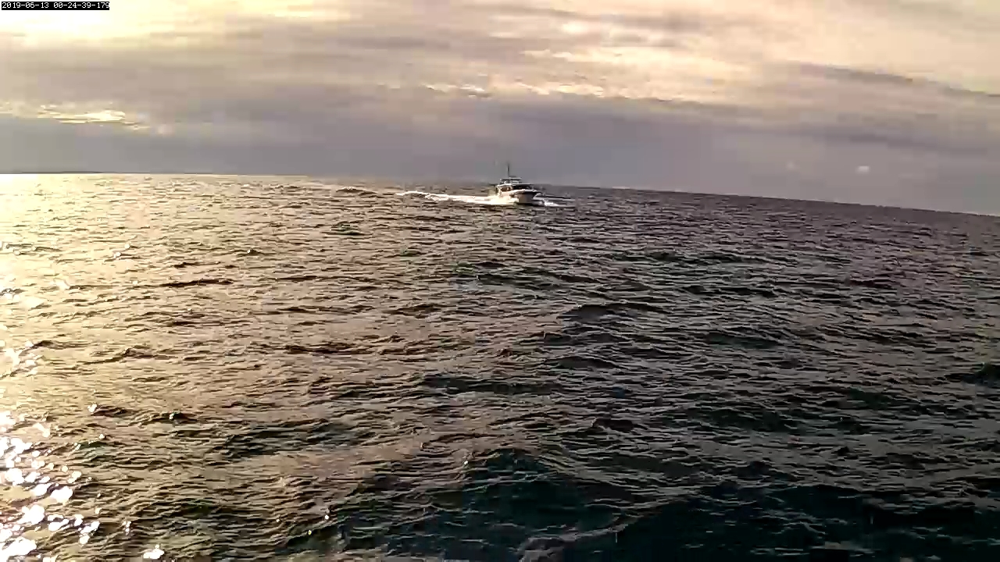

Dear Shareholders of Ocius, Friends and Colleagues,

As part of our Defence Innovation Hub contract, our Bluebottle USVs (BBs) have started running scenarios off the NSW Coast to test ‘team behaviours’ and ‘intelligent networking’.

The first scenario completed last week, ‘Bob’ and ‘Bruce’ were joined by 3 simulated Bluebottle USVs to demonstrate how a team of 5 Bluebottles can patrol and guard an asset in the ocean. Ulladulla Marine Rescue greatly assisted by having one of their vessels act as a suspected illegal intruder driving at 12 knots in the vicinity of the patrolled area.

When one of the team, in this case ‘Bruce”, detected the intruder he broadcast his ‘local view’ to the ‘team view’ i.e. he shouted out to his teammates.

Another member of the team, in this case Bob, autonomously decided that he was the best positioned member of the team to go and ‘investigate’. Bob then broadcast his intention to ‘investigate’ the suspicious vessel to his teammates and began moving to intercept the intruder. The other members of the team on hearing Bob’s decision began moving to continue covering the area left in Bob’s absence. Finally, the network raised an alarm to a ‘human on the loop’ at mission control. This all happened autonomously, without human intervention, and in less than a second.

Bluebottle Bob moved to a position where he could get a good view of the intruder. He waited at a safe distance while the intruder passed taking photos of the intruder so that it could be identified. The ‘team view’ is shared by all the members of the team and can be seen at mission control where the photos are assessed by a ‘human on the loop’ for further action.

This all happened on Thursday in real time and autonomously.

We are planning to repeat this and other scenarios over the next week before our Chief Engineer, Lloyd heads off on a well-deserved holiday.

You can watch live by visiting https://ocius.com.au/ and clicking the [LIVE button](https://usvna.ocius.com.au/usvna/oc_server). It does take some time to load depending on your server. Over on the right press START to get live camera feeds.

We would like to thank AMSA, Transport NSW, local fisherman, local mariners & Ulladulla Marine Rescue for their help in these trials.

<iframe width="100%" height="400" src="https://www.youtube.com/embed/UsbGVhS13g8" frameborder="0" allow="accelerometer; autoplay; encrypted-media; gyroscope; picture-in-picture" allowfullscreen></iframe>

We look forward to updating you again soon.

Robert Dane

CEO
