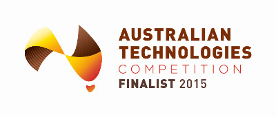

### Ocius has been selected as one of the finalists for the highly prestigious Australian Technologies Competition, 2015. [See Article from Austech](http://www.austechcomp.com/#!2014-finalists/c1xkg).

In response to the announcement CEO Robert Dane said “There are some fantastic companies in this prestigious competition and we are honoured to be selected as a finalist.”

“Oceans cover 70% of the earth’s surface, control climate and weather and are critical in the defence of many nations including Australia.”

“We are building unmanned ocean drones so that industrial, defence and scientific organisations conducting ocean monitoring, mapping and surveillance can obtain continuous coverage, save money, reduce error rates and remove people from harms way.”

Called “Bluebottles”, after the Australian jellyfish that uses its body to ‘sail’, Ocius unmanned surface vessels (USVs) can harvest the energy available at sea – solar, wind and wave energy. The result is a ‘disruptive’, autonomous data gathering & communications platform.

Ocius is taking advantage of global trends in technology development and pressure for governments and offshore operators to make large efficiency gains – “to do more with less”. Our USVs meet that need by offering multiple economic and operational advantages over conventional manned craft:

*   Greatly reduced CAPEX per square mile of ocean coverage
*   Greatly reduced OPEX needing no fuel, food or man hours
*   Greatly reduced cost per byte of data
*   Continuous coverage 24/7/365 days/year
*   Elimination of errors due to human fatigue
*   Removing people and expensive assets from dangers at sea
