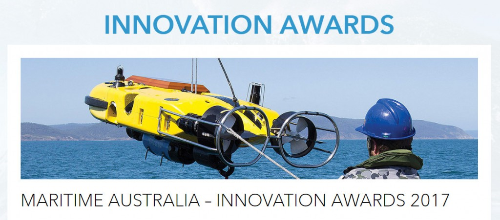

  The awards recognise and reward companies and individuals at the forefront of naval and maritime innovation.

OCIUS is honoured to be shortlisted as one of 15 Australian Companies for these prestigious awards.

CEO, Robert Dane commented “I know many of the CEOs and companies shortlisted and they are all great Australian Companies providing innovative technologies assisting the men and women of the Australian Defence Force in furthering their capabilities.”

The awards will be presented on **Wed 4th October at Pac 2017**

OCIUS
