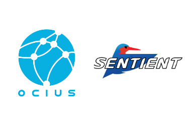

[Official Press Release Document](./Ocius-Sentient-Media-Release-DIH.pdf)

**Ocius Technology and Sentient Vision Systems, two of Australia’s most recognised innovative autonomous solution providers, today announced at the 2019 Defence Innovation Hub Annual Industry Conference, their collaboration to combine optical object detection onto the world leading BlueBottle unmanned surface vessel (USV).**

Both companies have been individually recognised for their autonomous solution capabilities and awarded separate multi-million dollar contracts by the Australian Government’s Defence Innovation Hub in November 2018, to further enhance those capabilities. Now, through natural collaboration, they are working together to combine them.

Sentient Vision is the only Australian provider of Intelligence, Surveillance, and Reconnaissance solutions that has been an integral part of every Australian Unmanned Aerial System program to date. The inclusion of Sentient Vision’s ViDAR payload further enhances the Ocius Technology autonomous BlueBottle USV platform’s persistent monitoring and surveillance capability.

This combined sovereign Australian solution of Ocius’ Bluebottle’s cutting-edge, patented technology and naturally inspired design combined with Sentient’s proven maritime capability is a fantastic example of the smart systems for which Australia is renowned.

>“Australia is responsible for 11% of the world’s oceans and has only 0.3% of the world’s population.” said Robert Dane, CEO of Ocius Technology. “We are committed to providing a capable, autonomous, persistent wide-area maritime surveillance system for our nation. BlueBottles can carry out maritime surveillance of Australia’s vast coastline at disruptively low cost, with no one in harm’s way and freeing up the Navy and Border Force fleets for other tasks.”

ViDAR, the world’s first optical radar, has changed the outcome for the detection of small and difficult to locate objects at sea since its launch in 2016. ViDAR can conduct persistent wide area searches, autonomously detecting small objects on the ocean’s surface, from a very small size weight and power optical sensor on manned and unmanned platforms.

In November 2018 BlueBottle USV, Bruce participated in the Autonomous Warrior War games in Jervis Bay. Due to extreme weather Bruce was often the only USV operating and its Command & Control (C2) system was used to control a Navy WAMV catamaran and 2 DSTG UUVs.

Ocius successfully demonstrated the ability of an 18’ BlueBottle USVs to carry 300kg of sensors including deploying from Ocius’ patented keel winch to varying depths advanced Thales sonar arrays, detecting passing vessels and communicating real time results.

In June, Ocius completed its second Defence contract with the Defence Innovation Hub with 6 weeks of sea trials ‘over the horizon’ off the NSW Coast, working with Navy, DST Gp, AMSA and UNSW - demonstrating an intelligent Command and Control Network of persistent unmanned surface vessels.

>"Sentient is proud of our continued close collaboration with the Australian Government. From our origins in the Defence Science and Technology Group’s Capability and Technology Demonstrator (CTD) program, through Defence Innovation Hub contracts, to our proud history of active deployments in support of the Australian Defence Force, we see the inclusion of our wide area motion imagery payload as a part of the BlueBottle USVs as a reinforcement of Australian leadership in advanced autonomous systems,” said Damien Tyrrell, Director of Business Development at Sentient Vision Systems.

ViDAR is deployed with the Australian Navy, the Australian Maritime Safety Authority, the US Coast Guard, and the US State Department, and has been lauded as fundamentally changing the success rate and way of conducting operations for broad area maritime surveillance.

**About Sentient Vision Systems:**

Sentient Vision Systems develops and deploys computer vision solutions for defence and civil applications. Since 1999 Sentient has specialised in video analytics with a primary focus on the development of automated detection software for full motion video. With nearly 2,000 systems deployed, Sentient’s solutions enhance the performance of EO/IR operations for many agencies and forces in more than 30 countries.

For more information, see [www.sentientvision.com](http://www.sentientvision.com)
