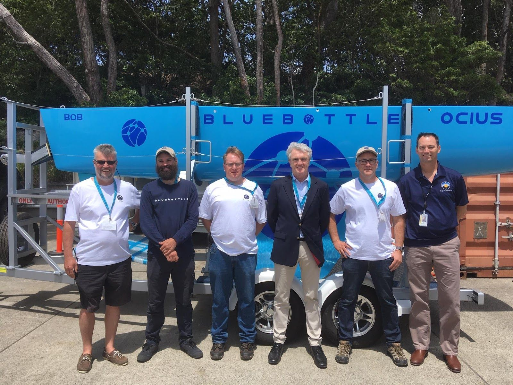

The AW18 Wargames started on Jervis Bay this week – a great success.

Robert Dane said “‘Bruce’s’ rudder flipper really proved itself yesterday. In a 25 – 30 knot Nor-Easter, ‘Bruce’ effortlessly maintained station 500m off a lee shore for 5 hours during the VIP guest tours. With our solarsail down and simply in “wave only mode” in overcast conditions ‘Bruce’ was charging his batteries.”

Lloyd Breckenridge, the Ocius team and Navy lead by LEUT Harry Hubbard from Waterhen have done terrific to work to make all of this happen in the time available. “GRIM” and ‘Bruce’ have been getting along fine and proven collision avoidance means there’s no problems when on separate missions with each other or any vessel with AIS.

Both ‘Bruce’ and “Grim” have underwater modems to ‘talk’ to DST UUVs doing exercises for Mine Counter measures and Counter arms smuggling.

During the games ‘Bruce’ will be also be carrying the Thales thin line array for Anti Submarine Warfare and Maritime Domain Awareness exercises

Ocius also had on display our next generation 18′ Bluebottle ‘Bob’. The 123 “Wild Oats” naval architects have made several improvements to ‘Bob’s’ design based on the performance of Bruce.

‘Bob’ also has a new next-generation rudder flipper.

You can follow ‘Bruce’ and “GRIM” live on the [‘Find Bruce’ web page https://ocius.com.au/usv/track-the-bluebottle/](https://ocius.com.au/usv/track-the-bluebottle/). On the left, toggle the button between WamV “GRIM” and Bluebottle ‘Bruce’. If you leave the page open and the boats ‘snail trails’ will grow.
