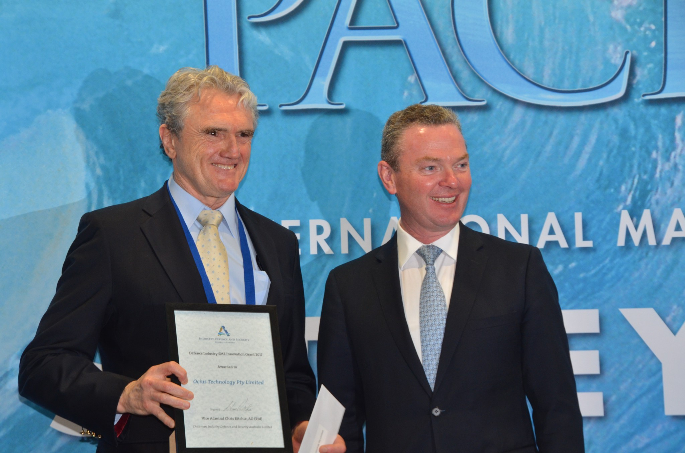
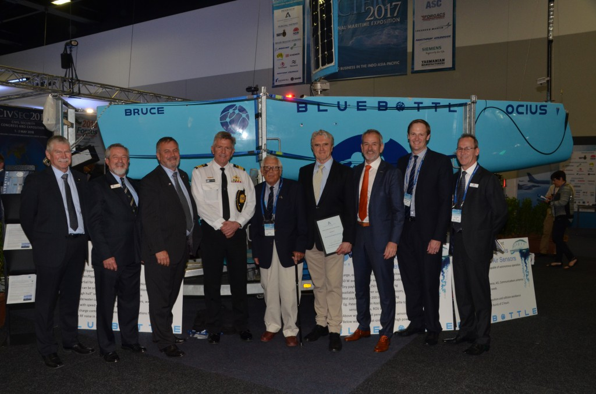

 **_PRESS RELEASE_** “The judges recommended this award go to OCIUS Technology Limited. The company is building unmanned ocean drones or unmanned surface vessels (USVs) called Bluebottles that run on the energy available at sea – solar, wind and wave energy. This results in a disruptive, autonomous surveillance and communications platform that can remain at sea for weeks or months at a time. OCIUS was awarded a CTD contract in 2015 leading to a successful demonstration in August of an anti-submarine warfare variant of the Bluebottle.” ¹

 Robert Dane – CEO of OCIUS accepting award from Christopher Pyne – Minister of Defence Industry

**OCIUS Technology’s ‘Bluebottle’ ocean drones are Unmanned Surface Vessels (USVs)**. They are named after the Australian marine animal that lives at sea and uses it’s body as a sail. **They harness the energy of the ocean, solar, wind and wave action to power themselves** allowing them to stay at sea almost indefinitely and move forward under all conditions. The Bluebottle’s patented ‘solar sail’ collects both solar and wind power, so it can sail when the wind is blowing or use solar power to drive its motor. If there is no sun and wind, the Bluebottle’s patented flipper and rudder appendage under the water steers and drives it forward against the waves. This means Bluebottles have a ‘speed of advance’ under all conditions. **The result is an autonomous data gathering and communications platform, a “satellite of the sea.”** The Bluebottle can roam the oceans almost indefinitely allowing defence, industry, and scientific personnel as well as border security and the oil and gas industry to monitor large areas of ocean at greatly reduced cost and with no one in harm’s way.

 From left to right: Air Vice Marshal Mark Skidmore AM – Spitfire Association , Mr Alan Steber – GM Steber International, Dr Alex Zelinski AO – Chief Defence Scientist, Commander Paul Hornsby – RAN Navy Strategic Command, Mr Lysle Roberts – Spitfire Association , Dr Robert Dane – OCIUS, Mr Chris Lloyd – Vice President Maritime Thales, Mr Duncan Challen – Executive Director at NSW Department of Industry. Commodore, Peter Scott CSC, RAN – Director of Defence NSW

Compared to conventional fossil fuel powered, manned and unmanned craft, **Bluebottles can operate continuously, at low cost and are ****almost silent.** Compared to other renewable energy powered USVs, **Bluebottles are superior having more power, payload and performance**, all in the one vessel.  Bluebottles have a massive 200 – 300kg payload capacity that can accommodate a variety of sensors or more batteries. The technology has been developed with assistance of a $3 million contract from the Commonwealth’s Defence Science and Technology Group (DSTG) Strategy Policy and Intelligence group, which has transitioned since into the Defence Innovation Hub. “**It’s an honour to be nominated and to be recognized within the industry among the wonderful Australian companies shortlisted,**” said OCIUS CEO, Robert Dane. “**The Maritime Australia Industry Innovation Awards started at Pac 2013 at the same time OCIUS had our first Bluebottle model on display. We’d like to thank the organisers and the judges for the tremendous job they’ve done supporting Australian Maritime Innovation.**” “**It has been truly a great Australian team effort to get to where we are today. We would like to thank our shareholders, partners and suppliers including the UNSW, Thales Australia, Steber International, One2three naval architects, Ulladulla Engineering & Fibreglass, Clarke IP and the Spitfire Association**.” ¹ [MARITIME AUSTRALIA INDUSTRY INNOVATION AWARD WINNERS 2017](https://pacific2017.com.au/innovation-awards/index.asp)