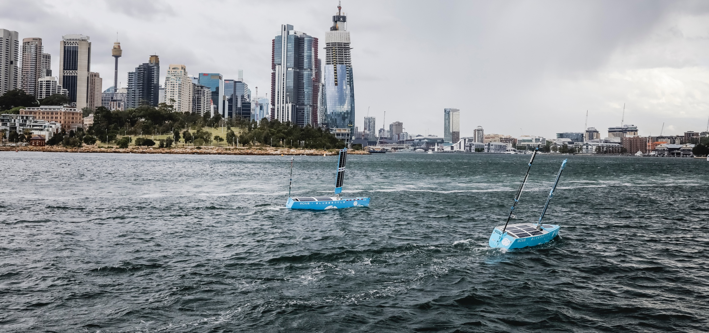
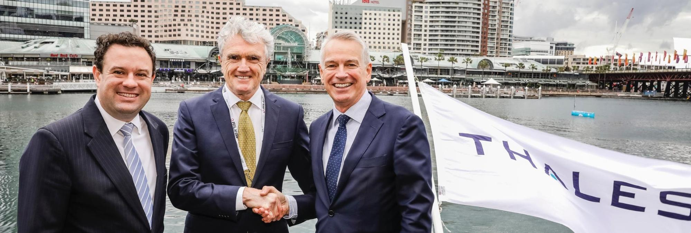

___

### Since our last update:

- Pacific 2019

- Ocius signs contract with Thales Australia

- Bob and Bruce attend Australian Autonomous Vessel Forum

___

### Pacific 2019

On Day One we started at dawn, deploying two Bluebottle Uncrewed Surface Vessels (USVs) off the coast performing ‘bistatic sonar’. Just like at Autonomous Warrior Wargames and on Lake Burley Griffin, the conditions were overcast, cold, raining and strong winds, but Bluebottle USVs Bob & Bruce methodically performed their duties.

The Ocius team was on the NSW Government stand receiving live data back from two Bluebottles. We noted an increased presence of people in uniform attending as well as from government and taking a greater interest in all the exhibitor’s stands. As Peter Jenkins, founder and Managing Director of JEDS, Vice President of AIDN NSW and a veteran of the industry for over 40 years declared on the final evening that this was “the best Pac ever!” We agree.

We thank AMSA, Transport NSW Roads & Maritime Services Division and all commercial mariners who helped make this exercise run smoothly and safely.
 
### Ocius signs contract with Thales Australia.
At Pac 2019, Ocius and Thales announced a contract between the two companies for Ocius to provide ‘platform services’ to Thales for the testing of the Thales thin line array on the Ocius Bluebottle USV platform.

 

This contract has been the result of a long-term collaboration between Ocius and Thales, with both parties working together to develop an autonomous sonar solution using the Thales array on a persistent marine platform.
 
### ‘Australian Autonomous Vessel Forum’.

On 20 Sept 2019, Bob and Bruce attended the final day of the Australian Maritime Safety Authority (AMSA) and Trusted Autonomous Systems Defence Cooperative Research Centre (TASCRC) ‘Australian Autonomous Vessel Forum’.

The forum provided a great opportunity to share different perspectives from industry, government and safety regulators on the challenges in applying existing regulations to new and emerging technology

We look forward to updating you again soon.
