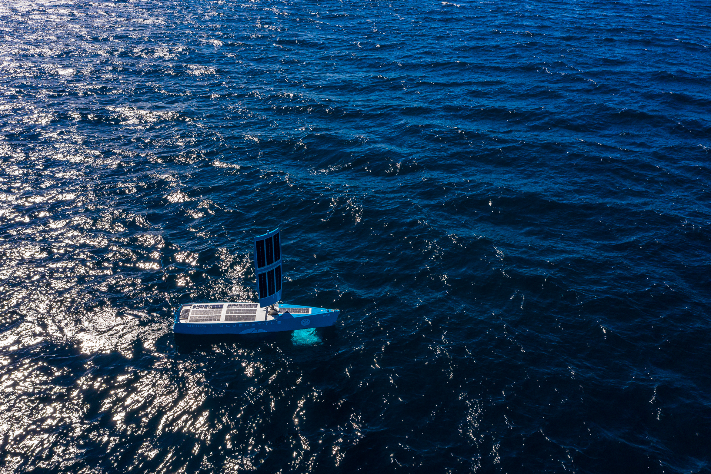
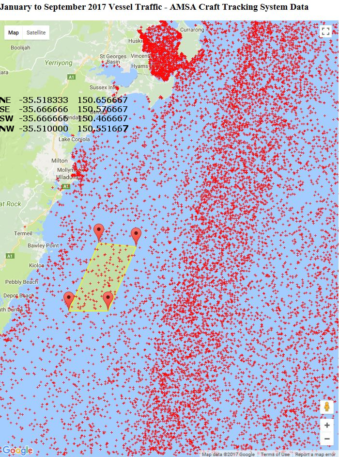

This week we commenced ocean trials off Ulladulla in a 50sq mile ‘box’ approved by AMSA, Transport NSW and local fisherman for the testing of unmanned systems.
 
Red dots represent shipping density over 6 months. High density of dots at top is Jervis Bay.

**Follow Bob live on our "[LIVE](/live)" button**.

See video from UAV here

<iframe width="100%" height="400" src="https://www.youtube.com/embed/LKxAiK_zVss" frameborder="0" allow="accelerometer; autoplay; encrypted-media; gyroscope; picture-in-picture" allowfullscreen></iframe>

