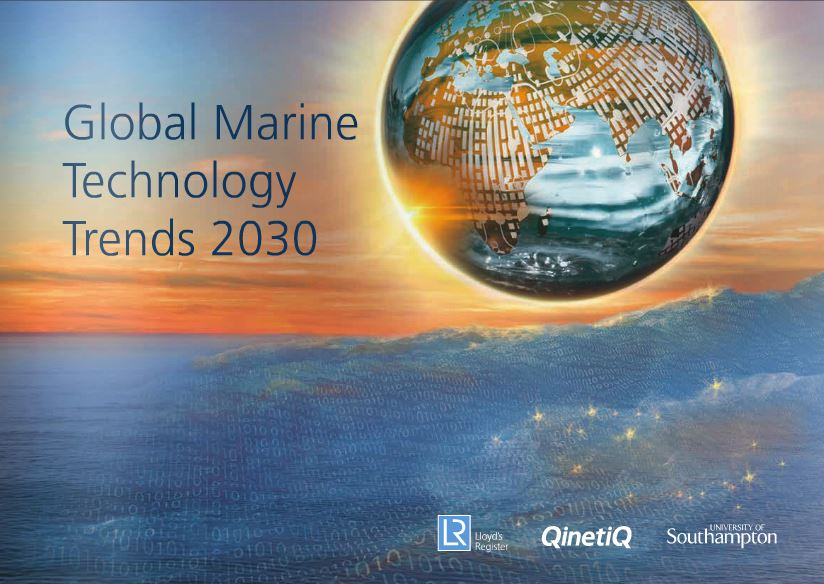

#### A major new report on maritime technology trends has found that “_big data analytics, autonomous systems, sensors and communication, sustainable energy generation… are transformational in nature when used individually and when combined_“

The Lloyds list and Qintiq report, published this week, identifies major emerging issues in naval defence, ocean science and industry through to 2030 and those technologies best placed to solve them. The report provides significant validation to Ocius’ focus on development of autonomous unmanned vessels (“Bluebottles”), which integrate and combine many of the technologies identified to deliver a wide range of applications.

The report can be downloaded in full **[here](http://issuu.com/lr_marine/docs/55046_lr2030_web-lr_25mb?e=11022570/15194298)**
