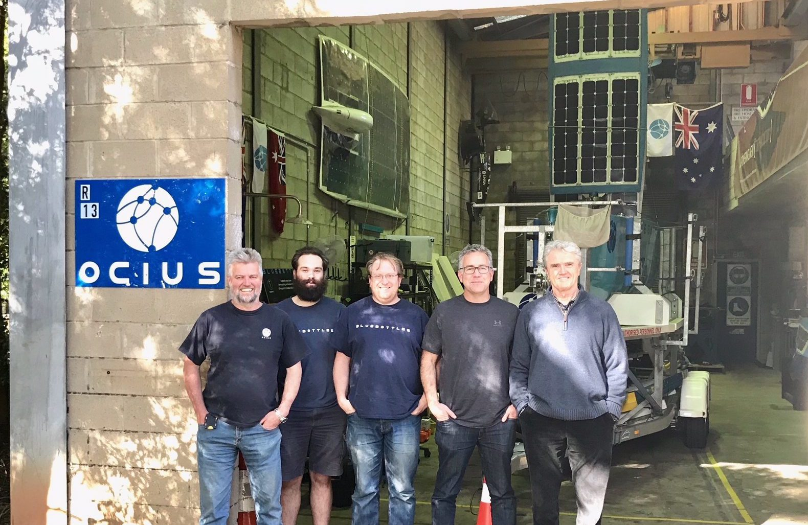

In partnership with UNSW”s Computer Science Department, OCIUS’ R&D lab has moved to a new freestanding 2-storey premises on the UNSW Randwick campus.

CEO Robert Dane said, “We’re continuing work with Prof Claude Sammut and the Computer Science Department – and these new premises are much improved and fit for purpose for what we want to do.”
