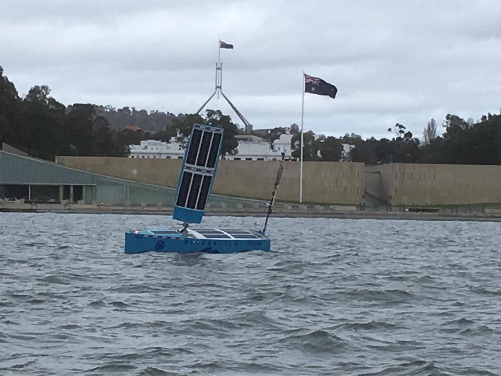
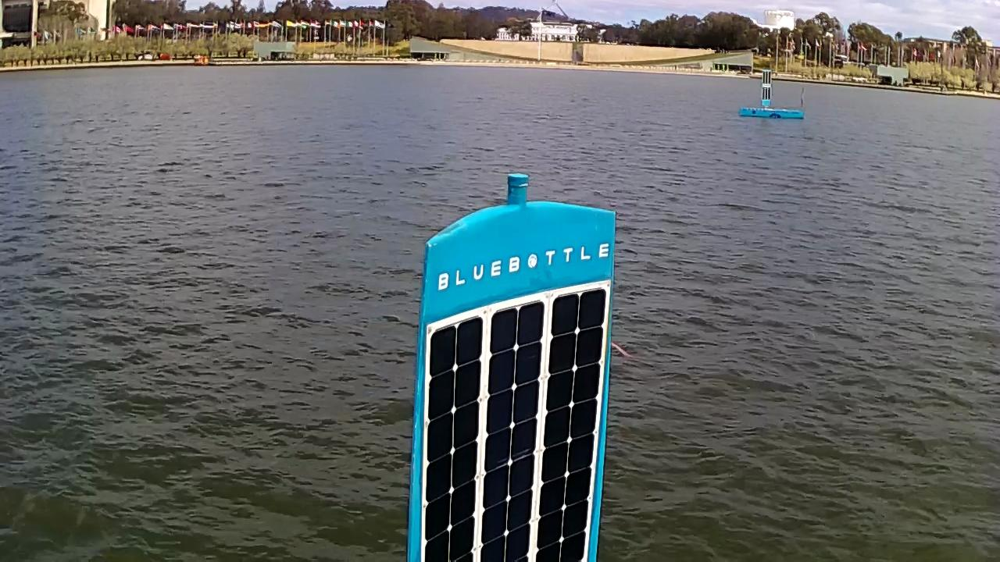
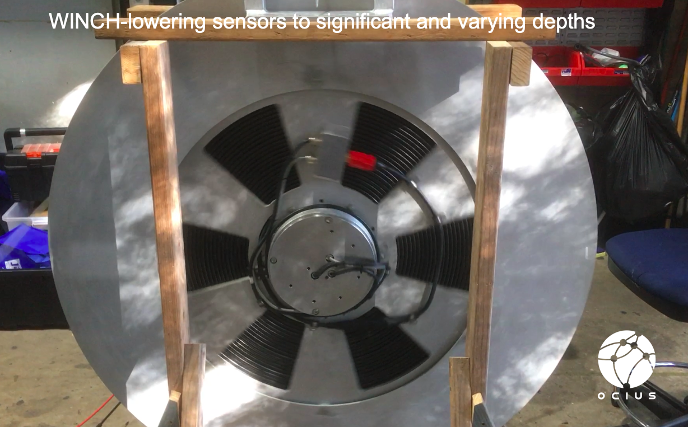
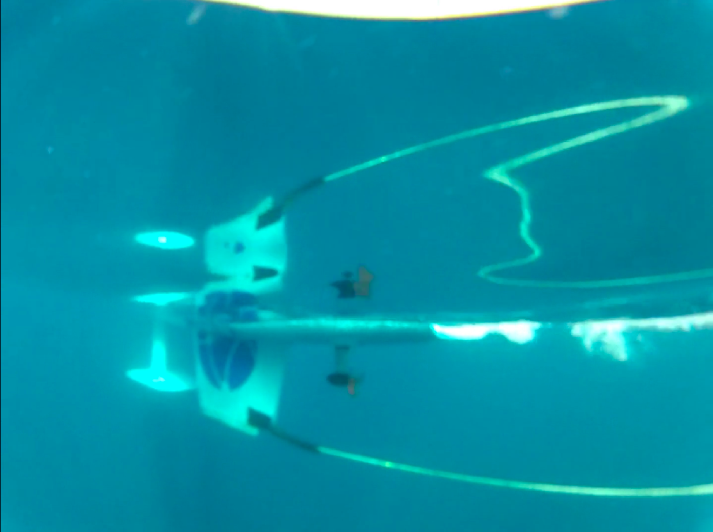

Last week, we were honoured to be invited by the Australian Maritime Safety Authority (AMSA) and approved by the National Capital Authority (NCA) to operate 2 Bluebottle Unmanned Surface Vessels (USVs) on Lake Burley Griffin in the week leading up to an AMSA and Trusted Autonomous Cooperative Research Centre (TASCRC) conference at the National Museum of Australia.

Just like at Autonomous Warrior Wargames in November, the weather was terrible. But, despite overcast conditions, freezing winds, rain and snow on the mountains, Bob & Bruce happily performed their duties.

We’d like to thank AMSA, National Capital Authority, Lake Users Group, Southern Cross Sailing Club, Canberra Rowing Club and Rowing ACT, owners and skippers of the MV Southern Cross, Lake Burley Griffin Cruises & Go Boats and all mariners for helping make this a safe and educational mission.

Bob and Bruce created a great deal of interest from WIN TV, Ch 2 TV, Canberra Times, ADM magazine and Navy news.

We’ll post links on our Latest News webpage when the links become available, but meantime please see [this great article in the ADM magazine interviewing Ocius, Commander Paul Hornsby, Navy’s lead for autonomous warfare systems and Gary Dawson, Thales Australia’s Vice President Strategy.]( https://www.australiandefence.com.au/news/ocius-bob-and-bruce-come-to-canberra)

### Testing ‘bistatic sonar’ capability in Ulladulla 2 – 6 Sept.
Once again, Thales and Ocius deployed to beautiful Ulladulla on the South Coast. We are grateful once more to Ulladulla Marine Rescue who acted as a support vessel and the illegal or suspicious vessel.

In one test (demonstrating 100% Australian sovereign capability) Thales played AC/DC from a test source and this was picked up kms away by Bruce’s array.

For those who are musically inclined, you may be able to hear the ‘reverb’ building as the ping goes on, which is the sound bouncing off the ocean floor.

In another test, we were able to autonomously detect an Ulladulla Marine Rescue vessel as well as a number of other marine vessels nearby during the trial in both Passive and Bi-static modes.

Finally, we successfully tested Thales’ new innovative underwater comms protocol which can be sent over long range utilising its RASS array (USV to Vessel or USV to USV), another all Australian developed innovation.

### Pacific 2019 Expo Darling Harbour Oct 8 -10:
All this testing is in preparation for Pac 2019. Thales and Ocius will have two Bluebottles on the harbour or off the coast beaming LIVE data and camera footage back to our display on the NSW Government Stand 2B2.  This development has been the result of a long-term collaboration between Ocius, Thales and Defence, with all parties committed to the advancement of autonomous sonar solutions as part of their respective development programs. Without this level of collaborative commitment between partners such projects would not be possible.

We’ll be presenting this testing and our recent Intelligent Network trials off the NSW coast at the Australian Association for Unmanned Systems’ (AAUS) “Autonomy in the Maritime Domain” conference and the Defence Innovation Network conferences - both held within the Expo.

We look forward to updating you again soon.
