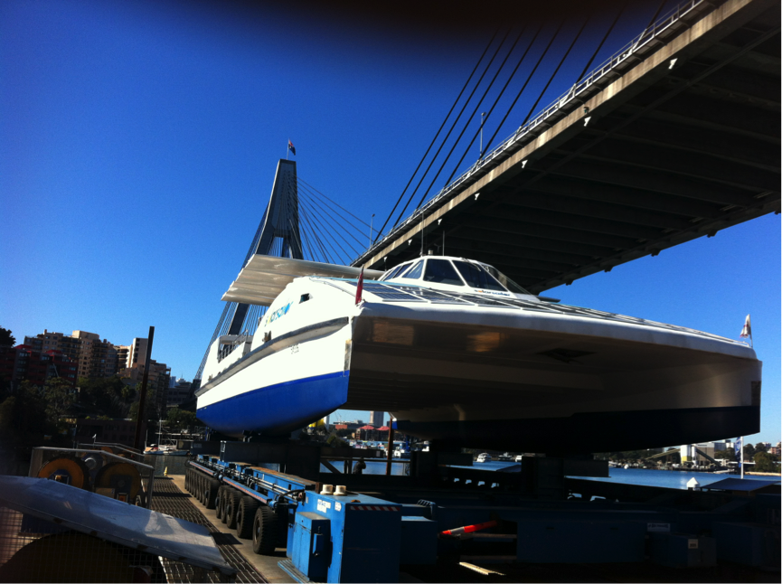
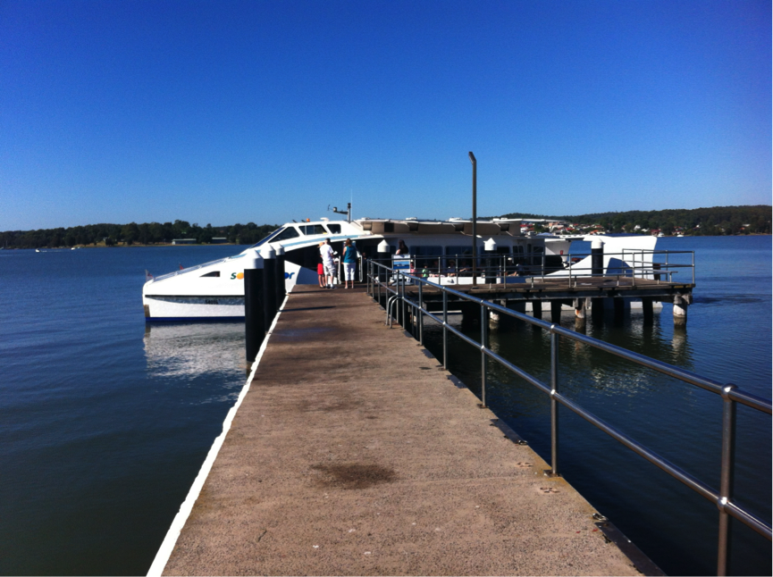

Yesterday our first commercial vessel, the multi award winning “_SolarSailor”_ was sold to a private buyer. The new owner plans to convert her to a live aboard cruising vessel to explore the East Australian coast and then SE Asia.

For us running a licensed dolphin cruise and charter business on Lake Macquarie for the last two years has been enormously rewarding. We would like to thank our staff and crew, especially Peleena and Keith as well as the people of Lake Macquarie, in particular the Lake Macquarie City Council, for their support and enthusiasm.

This pragmatic business decision gives Ocius a significant cash boost at this time as well as freeing management to focus time and resources on our core business –selling technology and data for Uncrewed Surface Vessels and commercial shipping.

