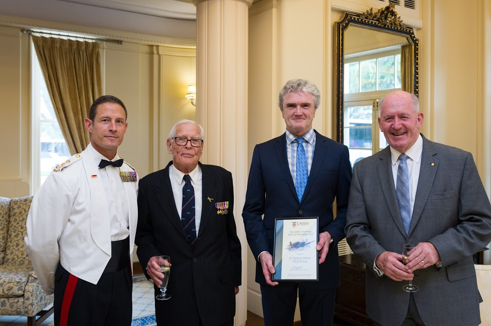

**Robert Dane, CEO of Ocius, receives 2017 Spitfire Memorial Defence Fellowship at Government House to develop a revolutionary ‘reel in the keel’ winch for unmanned surface vessels.**

In 2017 as part of a DST Group Capability Technology Demonstrator (CTD) contract, Ocius will demonstrate the towing 120m of Thales thin line array and electrical tow cable behind a Bluebottle USV to demonstrate the capability to detect and track submarines; i.e. Antisubmarine Warfare (ASW) USV – ASWUSV.

In considering the concept of operations, Ocius has devised a unique and patented ‘reel in the keel’ such that a BlueBottle USV can be launched and retrieved with the array (or any sensor for that matter) in situ, the sensor or array can be lowered to any depth as necessary, retrieved and stowed at sea, carried long distances and then re-deployed at waypoints and ‘choke points’ of interest.

For the first ASWUSV specifically, Ocius needs to develop and carry a 105kg winch with array 1m in diameter to be fitted to a 18 foot, 1m beam, 450kg lightship boat.

The Spitfire Memorial Defence Fellowship 2017 will enable Ocius to develop, build and test its revolutionary ‘reel in keel’ winch device.

Robert Dane said:

> “This is a highly desirable capability for a unmanned surface vessel for many applications. We are honoured to be working with the Spitfire Memorial Defence Association – this award is a great honour.”

  On Monday 6 December 2016, His Excellency Sir Peter Cosgrove AK, MC, Governor-General of the Commonwealth of Australia, hosted a reception for Australian Defence Force Academy (ADFA) Graduands, Royal Military College (RMC) Staff Cadets and the Spitfire Association.

Left to Right:

Brigadier Mark Brewer, CSC and Bar, Commandant of the Royal Military College Duntroon

Lysle Roberts – Spitfire Pilot and Life Member Spitfire Memorial Association

Robert Dane

His Excellency General the Honourable Sir Peter Cosgrove AK MC (Retd)
