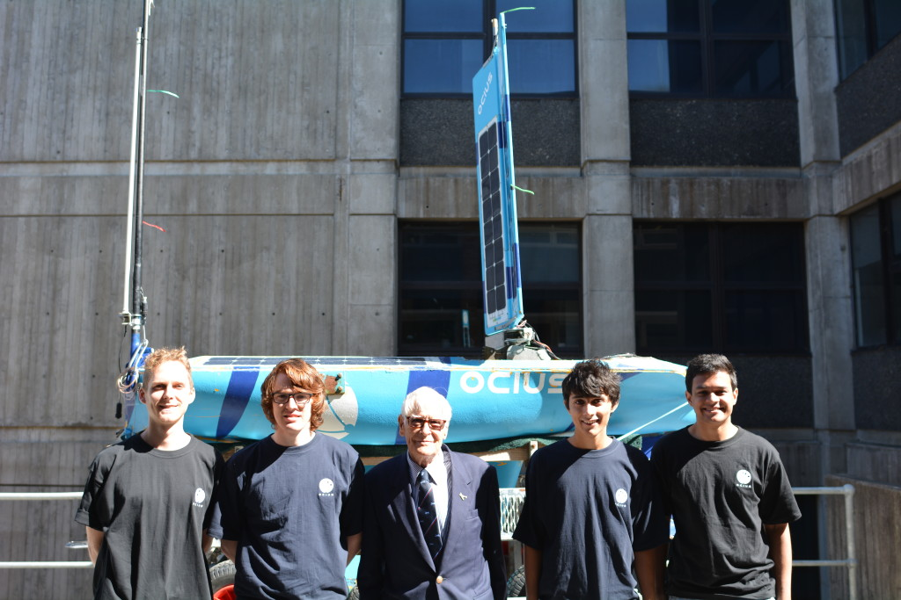

This annually awarded Fellowship has been established by ex-WW2 Spitfire Pilots and their ground crews. Set up by the Spitfire Association and leading private and corporate supporters, it is a lasting and dynamic memorial to the significant contribution of the Spitfire and it’s squadrons during World War II.

The Fellowship provides encouragement for the development of advanced knowledge and expertise, which will aid the defence of Australia by financial support of at least $30,000 per annum, and public recognition to senior students and academics who will undertake programs of study or research at the University of NSW (The Australian Defence Force Academy in Canberra or Sydney) or other appropriate institutions within or outside Australia.

Since its inception in 1998, seven fellowships have been awarded and all recipients have achieved and been recognised for their excellent research.

This Fellowship is open to Australian citizens who are suitably qualified graduates or who have significant appropriate work experience and feel enthusiasm to meet the above mentioned criteria.

This is an unusual Memorial to participants of World War II, the survivors being less concerned with monuments and plaques, but more with the future and protection of their country. It is a unique Memorial, a living Memorial to the service of Spitfire Squadrons in World War II.

Spitfire pilot Lysle Roberts said “the Spitfire Memorial Fellowship was conceived and established by Pilots of my old Spitfire Squadron No. 457 to honour the memory of that great Aircraft and it’s versatility. The aim of the Fellowship is to find projects, being carried out by Australian Citizens which can aid the defences of our fine Country.”

Following a visit to Ocius facility at UNSW by Lysle Roberts and Les Field from the the Spitfire Memorial Fellowship committee, Ocius has been awarded a scholarship to engage four UNSW engineering and computer science undergaduates to work on the Ocius Bluebottle Unmanned Surface Vessel Stinger V1 prototype. The successful students are pictured from Left to Right in the photograph – Connor Mcleod, Tom Drainsfield, Lysle Roberts (Spitfire pilot and comittee member) Ravi Raj, Aamir Alikhan and Brett Ryall (not present).

Ocius CEO Robert Dane said, “We are honoured to meet the Spitfrie committee and privileged to be able to offer this scholarship to these five amazing young Australians. The aim is to be able to carry at 5 knots a 105kg payload, in this case a towed array and winch and be able to deploy, tow and retireve it as required . This has never been done before on such a small (450kg) unmanned vessel. The students will be designing, installing and testing subsystems and in the end researching its capability to do a number of jobs including antisubmarine warfare. This is good for us, the students, UNSW and Australia.”
