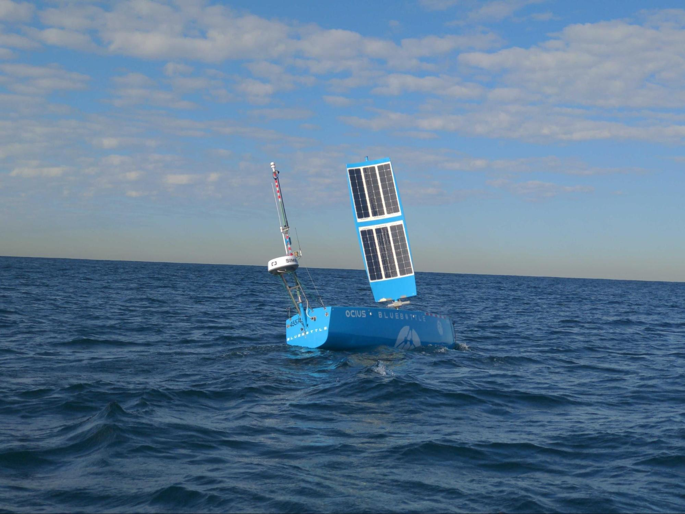
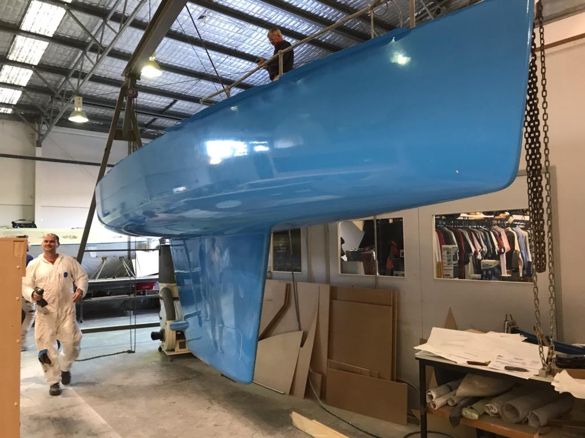
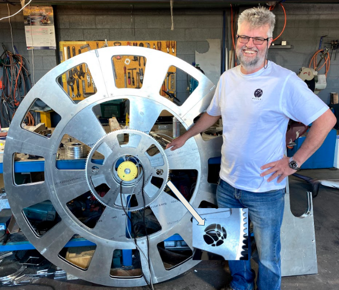

Last week, Bob the Bluebottle left Botany Bay heads at 11am Wednesday the 1st of July arriving at Ulladulla heads at 3pm Thursday 2nd of July, a distance of 96 nautical miles, averaging 3.4 knots. 
  
Bob used 360-degree cameras, radar, Automatic Identification Systems (AIS) and collision avoidance software to autonomously navigate safely during the voyage, with engineers at our R&D facility at UNSW Campus Randwick and at Charles Darwin University (CDU) Darwin taking it in turns being the 'human on the loop' supervisors.

Previously, we have escorted USVs out to a 50sq nautical mile AMSA approved area, 20 nautical miles off Ulladulla, where we could operate autonomously. However, we are now approved by AMSA to operate Bob (and brother Bruce) Bluebottles as Domestic Commercial Vessels (DCV) under the Marine Safety (Domestic Commercial Vessel) National Law Act 2012.  This means they are permitted to operate autonomously out to the extent of Australia’s Exclusive Economic Zone. We thank AMSA for working with us to achieve this excellent result.

Following this successful trial, Bob is heading to Darwin to begin logistics and sea trial tests before the first new next-generation Bluebottle Beth arrives in September - see picture below.

This will be followed by four more Bluebottles in 2021, each armed with Thales thin line sonar arrays, radar, cameras and other sensors.

Under our new Defence Innovation Hub Contract, in 2021, we will deploy 5 Bluebottles in an intelligent networked squad to 3 different Areas of Operations doing 3 different types of jobs. 

https://www.minister.defence.gov.au/minister/melissa-price/media-releases/growing-australias-defence-industry-through-innovation

We look forward to updating you again soon.
