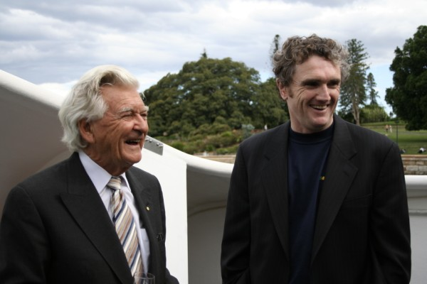
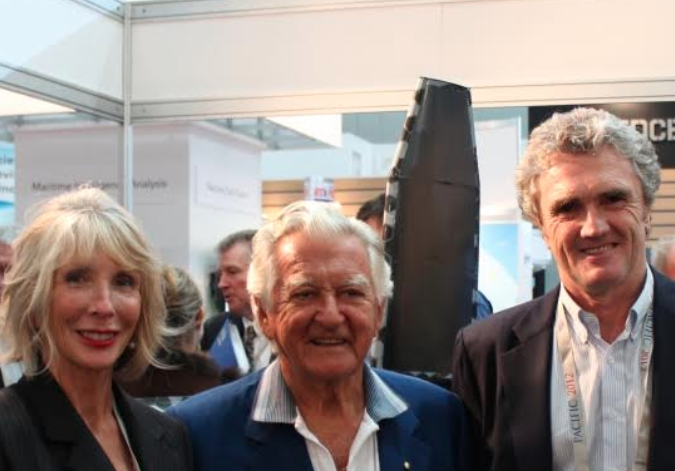
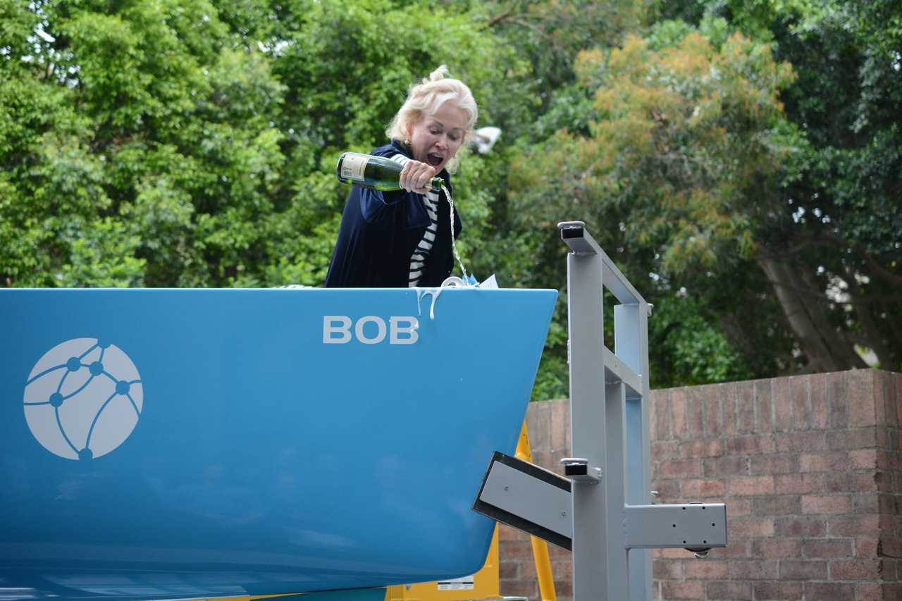
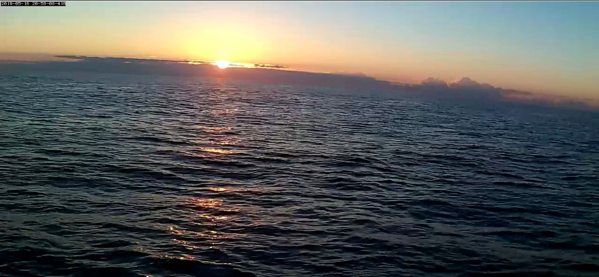

We deeply mourn the loss of our dear friend and ex-Chairman Hon Bob Hawke.

We are honoured to have had his wisdom and wit in our lives.

We were a tiny Australian start-up and he took us under his wing in 2001. This speaks volumes, not about us, but about his vision for Australia and belief in a better future for all.

We are really pleased that we were able to build and christen our latest prototype ‘Bob’ in his honour and he was able to see photos and videos recently of ‘Bob’ beginning ocean trials.

We won’t forget the things he said or the way he made us feel.

## And so may we say “Long live Bob”

